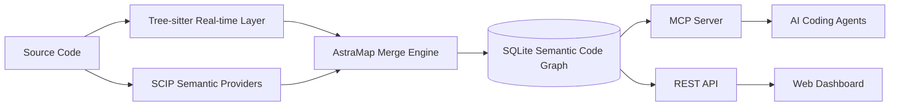

# AstraMap — 面向 AI 编程代理的语义代码地图与代码图谱

**中文** | [English](README_EN.md)

> Semantic Code Map · Code Graph · Code Intelligence · MCP Server

AstraMap 是一个面向 **Claude Code、Codex、Cursor 及其他 AI 编程代理**的高精度语义代码地图引擎。它融合 **SCIP 编译器级语义**与 **Tree-sitter 实时代码解析**，把整个代码库转换为可查询的节点与关系图，为 AI 提供符号定位、调用链追踪、依赖分析、变更影响分析和低 Token 代码导航能力。

```text
源代码 → Tree-sitter 实时层 + SCIP 语义层 → SQLite 代码图谱 → MCP / REST API → AI Agent / Dashboard
```

## 为什么需要 AstraMap

AI 编程代理理解大型代码库时，通常依赖 `grep`、文件搜索和反复读取源码。这种方式不仅消耗大量上下文，还容易遗漏跨文件调用、接口实现和间接依赖。

AstraMap 将代码库预先构建为可查询的 **Semantic Code Graph**：

| 开发问题 | 传统方式 | AstraMap |
|---|---|---|
| 某个函数在哪里定义？ | 搜索名称，再逐个打开文件判断 | `astramap_search` / `astramap_node` |
| 谁调用了这个函数？ | 多轮 grep，人工排除同名符号 | `astramap_callers` |
| 修改它会影响什么？ | 手工追踪调用链和模块依赖 | `astramap_impact` / `amap diff` |
| 两个模块如何关联？ | 阅读多个目录和入口文件 | `astramap_explore` / `astramap_trace` |
| 项目有哪些复杂度风险？ | 分别运行多个分析工具 | `amap hotspots` / `deadcode` / `cycles` |

AstraMap 的目标不是替代源码，而是为 AI 和开发者提供一张**精确、实时、可追踪的代码导航底图**。

## 核心能力

| 能力 | 说明 |
|---|---|
| **语义代码地图** | 将函数、方法、类型、文件和模块组织为节点，将调用、引用、继承、实现和导入组织为关系边 |
| **编译器级跨文件语义** | 通过 SCIP 获取跨文件引用、调用关系、类型信息和符号消歧，减少基于名称猜测产生的误判 |
| **实时增量更新** | Tree-sitter 及时反映磁盘上的最新代码；文件变化后按哈希增量更新，不必重复全量扫描 |
| **MCP Server** | 为 Claude Code、Codex、Cursor 等 MCP 客户端提供结构化代码导航工具 |
| **调用图与影响分析** | 支持 callers、callees、调用路径、递归影响传播、依赖图和耦合分析 |
| **代码理解文档** | 生成函数、文件、模块和项目级理解文档，并呈现复杂度、依赖关系和架构风险 |
| **大型项目过滤** | 自动排除依赖、构建产物、缓存、生成代码、二进制文件和其他非业务源代码 |
| **C/C++ 条件编译感知** | 将 `#if`、`#ifdef`、`#ifndef` 等守卫信息标注到关系边，保留调用成立的条件上下文 |

## 交互式代码图谱

Dashboard 与 MCP Server 共享同一份 SQLite 语义图谱，搜索、定位、源码预览、调用追踪和理解文档使用统一的符号身份。

### 探索视界

从项目、目录、文件或函数进入，先观察全局结构，再逐层深入局部实现。


### 依赖关系

围绕目标函数展开调用邻域，同时查看调用者、被调用者、上游祖先、下游后代及相关节点。


### 理解文档

生成函数、文件、模块和项目四个粒度的结构化理解文档，辅助代码阅读、审查、重构和交接。


## 工作原理

AstraMap 采用“**Tree-sitter 实时层 + SCIP 最终语义层**”的双层架构。

```text
SCIP 语义层
  └─ 跨文件调用、定义与引用、类型关系、实现关系、符号消歧

Tree-sitter 实时层
  └─ 当前文件结构、函数签名、注释、局部调用与增量变更

合并引擎
  └─ 统一节点身份、来源追踪、冲突处理和增量收敛

SQLite 代码图谱
  └─ nodes + edges + files + FTS5 全文搜索
```



Tree-sitter 擅长快速解析当前文件，但单独使用时无法可靠解决复杂的跨文件符号关系。SCIP 由语言工具链生成，能够提供确定性更强的跨文件语义。AstraMap 将两者合并：既保证代码变化能够及时进入地图，也保留编译器级的最终语义精度。

## 快速开始

### 1. 构建 CLI

```bash
go build -o amap ./cmd/amap
```

### 2. 为项目建立代码地图

```bash
./amap index --project /path/to/project
```

未显式提供 SCIP 索引时，AstraMap 会检测项目语言与可用 Provider；缺少语义工具链时，仍可使用内置 Tree-sitter 实时层完成基础索引。

### 3. 注册 MCP Server

```bash
./amap install
```

该命令用于将 AstraMap 注册到支持的 AI 编程工具。也可以直接启动 stdio MCP Server：

```bash
./amap serve --project /path/to/project
```

### 4. 启动可视化控制台

```bash
./amap dashboard --project /path/to/project
```

### 5. 持续同步代码变化

```bash
./amap watch 10 --project /path/to/project
```

常用索引模式：

```bash
./amap index --tree-sitter     # 仅使用 Tree-sitter 实时层
./amap index --refresh-scip    # 强制重新生成 SCIP 语义索引
./amap index --full            # SCIP 全量刷新 + Tree-sitter 同步
./amap index --scip index.scip # 导入已有 SCIP 文件
```

首次运行会生成 `.astramap/config.yaml`，用于控制语言、包含路径和排除规则：

```yaml
index:
  languages:
    - go
  exclude:
    - "docs/**"
    - "vendor/**"
  include:
    - "src/**"
```

## AI Agent 使用场景

完成 MCP 注册后，AI Agent 可以通过结构化工具查询代码库，而不是反复扫描所有文件。

| 你可以这样提问 | AstraMap 工具 |
|---|---|
| “`handleRequest` 在哪里定义？” | `astramap_search`、`astramap_node` |
| “谁调用了 `handleRequest`？” | `astramap_callers` |
| “它内部调用了哪些函数？” | `astramap_callees` |
| “修改这个函数可能影响哪些模块？” | `astramap_impact` |
| “认证流程从入口到数据库怎么走？” | `astramap_explore`、`astramap_trace` |
| “这个项目当前索引是否完整？” | `astramap_status` |
| “列出 `src/network` 下已索引的文件。” | `astramap_files` |

### MCP 工具

| 工具 | 作用 |
|---|---|
| `astramap_search` | 模糊搜索函数、方法、类型及其他符号 |
| `astramap_explore` | 围绕业务概念或符号探索相关文件、代码和关系 |
| `astramap_node` | 查看符号定义、签名、位置、源码和关联关系 |
| `astramap_callers` | 查询直接调用者 |
| `astramap_callees` | 查询直接被调用者 |
| `astramap_impact` | 递归分析变更影响范围 |
| `astramap_trace` | 查找两个符号之间的调用路径 |
| `astramap_status` | 查看索引覆盖、文件状态和数据来源 |
| `astramap_files` | 按目录或模式查询已索引文件 |

## 支持语言

Core 内置以下 12 种语言的 Tree-sitter 实时解析，并可通过对应的 SCIP Provider 获得更完整的跨文件语义。

| 语言 | 扩展名 | 语义 Provider | 内置实时解析 |
|---|---|---|---|
| Go | `.go` | `scip-go` | Tree-sitter |
| TypeScript | `.ts` `.tsx` | `scip-typescript` | Tree-sitter |
| JavaScript | `.js` `.jsx` `.mjs` `.cjs` | `scip-typescript` | Tree-sitter |
| Python | `.py` | `scip-python` | Tree-sitter |
| Java | `.java` | `scip-java` | Tree-sitter |
| Kotlin | `.kt` `.kts` | `scip-java` | Tree-sitter |
| Scala | `.scala` `.sc` | `scip-java` | Tree-sitter |
| C | `.c` `.h` | `scip-clang` | Tree-sitter |
| C++ | `.cc` `.cpp` `.cxx` `.hpp` `.hxx` | `scip-clang` | Tree-sitter |
| Rust | `.rs` | `scip-rust` | Tree-sitter |
| C# | `.cs` | `scip-dotnet` | Tree-sitter |
| Ruby | `.rb` `.rake` | `scip-ruby` | Tree-sitter |

外置 Syntax Overlay 只能覆盖正式语言的内置语法实现，不扩展 Core 的语言注册表、项目单元或语义 Provider 边界。

```bash
./amap syntax install --trust-key ./trusted-keys.json ./language-syntax.amaplang
./amap syntax list
./amap syntax doctor ruby
```

## CLI 命令

### 核心服务

| 命令 | 说明 |
|---|---|
| `amap serve` | 启动 MCP stdio Server |
| `amap dashboard` | 启动 Web Dashboard |
| `amap index` | 构建或增量更新代码地图 |
| `amap watch [seconds]` | 监听代码变化并持续同步 |
| `amap install` | 注册 MCP Server 到 AI 编程工具 |

### 代码导航与质量分析

| 命令 | 说明 |
|---|---|
| `amap locate <symbol>` | 定位符号定义 |
| `amap diff [--suggest-tests]` | 分析 Git 变更影响并建议测试范围 |
| `amap tree <symbol>` | 输出调用拓扑树 |
| `amap hotspots` | 查找高风险代码热点 |
| `amap deadcode` | 检测不可达函数和方法 |
| `amap cycles` | 检测循环依赖 |
| `amap coupling [--path=...]` | 分析模块传入、传出耦合 |
| `amap owners <symbol>` | 基于 Git blame 查询代码所有权 |
| `amap query "<SQL>"` | 直接查询 SQLite 代码图谱 |

## REST API

Dashboard 同时提供 REST JSON API，适合 IDE、内部平台和自动化系统集成。

主要端点包括：

```text
/api/astramap/status
/api/astramap/search
/api/astramap/node/{id}
/api/astramap/callers/{id}
/api/astramap/callees/{id}
/api/astramap/impact/{id}
/api/astramap/explore
/api/astramap/trace
/api/astramap/overview
/api/astramap/functions
/api/astramap/data
/api/graph/module
/api/documents/generate
```

## 生态感知过滤

AstraMap 的原则是：**代码地图只索引手写的、承载业务语义的源代码。**

系统会识别项目生态并自动排除常见的依赖、缓存、构建产物和生成文件：

| 生态 | 识别标记 | 典型自动排除 |
|---|---|---|
| Go | `go.mod` | `vendor/`、Go 缓存 |
| Node.js | `package.json` | `node_modules/`、`dist/`、`.next/`、`coverage/` |
| Rust | `Cargo.toml` | `target/` |
| Maven / Gradle | `pom.xml`、`build.gradle` | `target/`、`.gradle/`、`build/` |
| CMake | `CMakeLists.txt` | `build/`、`cmake-build-*/` |
| Python | `pyproject.toml` | `__pycache__/`、`.venv/`、`*.egg-info/` |
| Bazel | `WORKSPACE` | `bazel-*/` |

内置规则还覆盖版本控制元数据、二进制文件、压缩文件、压缩后的前端资源以及带有 `generated` / `DO NOT EDIT` 标记的生成源码。用户可通过 `.astramap/config.yaml` 使用 include、exclude 和 force-include 覆盖默认行为。

## 性能与存储

AstraMap 使用 SQLite WAL、FTS5、内存映射、查询缓存和批量节点解析，以支持大型代码库的增量索引与并发读取。

| 项目规模 | 索引数据库参考值 | 索引时间参考值 |
|---|---:|---:|
| 1 万行 | 2–4 MB | 少于 5 秒 |
| 10 万行 | 12–20 MB | 10–30 秒 |
| 50 万行 | 50–100 MB | 1–3 分钟 |

> 实际结果取决于语言、符号密度、SCIP Provider、磁盘性能和项目构建环境。建议在正式发布前使用公开基准仓库补充可复现的 benchmark。

## 项目定位

AstraMap 适合以下场景：

- 为 AI 编程代理提供代码库级语义上下文
- 构建代码导航、代码理解和代码问答能力
- 分析调用图、依赖图和变更影响范围
- 辅助大型遗留代码阅读、审查、重构和测试设计
- 将代码图谱能力集成到 IDE、研发平台或多 Agent 系统

相关关键词：`semantic code map`、`code graph`、`code intelligence`、`codebase intelligence`、`MCP server`、`AI coding agent`、`call graph`、`dependency graph`、`impact analysis`、`SCIP`、`Tree-sitter`。

## 许可

© 2025–2026 何志川 · AstraMap v0.3
