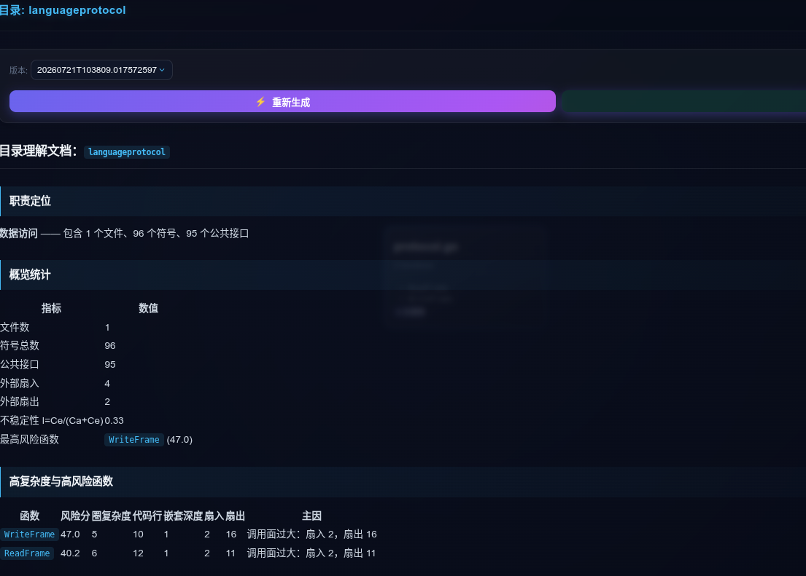
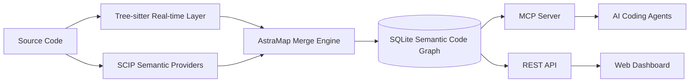

# AstraMap — 面向 AI 编程代理的语义代码地图

**中文** | [English](README_EN_public.md)

> Semantic Code Map · Code Graph · Code Intelligence · MCP Server

AstraMap 是一个本地优先的**语义代码地图与代码图谱引擎**，面向 Claude Code、Codex、Cursor 以及其他支持 MCP 的 AI 编程工具。

它把代码库转换为可查询的“符号节点 + 语义关系边”，让 AI 不必依赖反复 `grep` 和整文件读取，就能完成符号定位、调用链追踪、依赖探索和变更影响分析。

```text
源代码
  ├─ Tree-sitter：快速解析当前文件结构
  └─ SCIP：提供跨文件、类型感知的最终语义
          ↓
      AstraMap 合并引擎
          ↓
 SQLite Semantic Code Graph
          ↓
 MCP Server · REST API · Web Dashboard
```

## AstraMap 能解决什么

| 你想知道的问题 | AstraMap 提供的能力 |
|---|---|
| 某个函数、类型或方法在哪里定义？ | 语义符号搜索与精确定位 |
| 谁调用了这个函数？它又调用了谁？ | Callers / Callees 查询 |
| 两个模块之间是怎样关联的？ | 代码探索与调用路径追踪 |
| 修改某个符号会影响哪些文件和模块？ | 递归影响分析与 Git Diff 分析 |
| 大型仓库中哪些内容不应进入 AI 上下文？ | 生态感知过滤与生成文件排除 |
| 如何让 AI 用更少上下文理解代码库？ | MCP 结构化查询与按需源码片段 |

AstraMap 不替代源码，也不替代编译器。它为 AI Agent、IDE 和研发平台提供一张**可查询、可追踪、可持续更新的代码导航底图**。

## 核心特性

- **语义代码地图**：统一组织函数、方法、类型、文件和模块，以及调用、引用、导入、继承和实现关系。
- **双层索引架构**：Tree-sitter 负责实时结构，SCIP Provider 负责跨文件语义与符号消歧。
- **增量同步**：基于文件状态和内容哈希更新变更文件，无需每次全量重建。
- **MCP 原生接入**：为 Claude Code、Codex、Cursor、VS Code 等客户端提供结构化代码查询工具。
- **调用与影响分析**：支持 callers、callees、路径追踪、递归影响传播、循环依赖和耦合分析。
- **本地可视化**：Web Dashboard 展示项目结构、调用邻域、源码片段和理解文档。
- **生态感知过滤**：自动排除依赖目录、构建产物、缓存、二进制文件和生成代码。
- **C/C++ 条件编译感知**：保留 `#if`、`#ifdef`、`#ifndef` 等守卫上下文。

## 界面预览

### 探索视界

从项目、目录、文件或函数进入，先观察全局结构，再逐层深入局部实现。


### 依赖关系

围绕目标函数查看调用者、被调用者和相关调用路径。


### 理解文档

生成函数、文件、模块和项目级结构化文档，辅助代码阅读、审查、重构和交接。



## 快速开始

完整的平台安装、SCIP Provider 配置和排障方法见 [QUICKSTART.md](QUICKSTART.md)。

### 1. 构建并安装

在 AstraMap 仓库根目录执行：

```bash
./build.sh

mkdir -p "$HOME/.local/bin"
install -m 755 ./amap "$HOME/.local/bin/amap"
export PATH="$HOME/.local/bin:$PATH"
```

验证安装：

```bash
amap --help
```

> Go 版本要求以仓库中的 `go.mod` 为准。Windows 用户请构建 `amap.exe`，并将其所在目录加入用户 PATH。

### 2. 进入需要分析的项目

```bash
cd /path/to/your/project
```

### 3. 注册 MCP

```bash
amap install
```

该命令会探测本机已安装的客户端，并只为实际存在的客户端写入 AstraMap MCP 配置。

### 4. 首次构建代码地图

```bash
amap index
```

首次运行会创建：

```text
.astramap/
├── config.yaml
└── astramap.db
```

### 5. 启动 Dashboard

```bash
amap dashboard
```

浏览器访问：

```text
http://localhost:3000
```

### 6. 持续同步（可选）

建议在独立终端中运行：

```bash
amap watch 30
```

不要同时启动多个 watcher，以免重复扫描和增加数据库写入。

## AI Agent 使用示例

完成 MCP 注册后，可以在 IDE编程工具问：测试代码地图，验证代码地图的有效性。


对应 MCP 工具：

| 工具 | 用途 |
|---|---|
| `astramap_search` | 搜索函数、方法、类型及其他符号 |
| `astramap_explore` | 围绕业务概念或符号探索相关文件和关系 |
| `astramap_node` | 查看符号定义、签名、位置和源码片段 |
| `astramap_callers` | 查询直接调用者 |
| `astramap_callees` | 查询直接被调用者 |
| `astramap_impact` | 递归分析变更影响范围 |
| `astramap_trace` | 查找两个符号之间的调用路径 |
| `astramap_status` | 查看索引覆盖与数据来源 |
| `astramap_files` | 按目录或模式查询已索引文件 |

## 架构概览

AstraMap 使用“实时结构 + 最终语义”的双层模型。



### Tree-sitter 实时层

- 快速解析当前磁盘文件
- 提取定义、签名、注释和局部调用
- 支持文件级增量更新
- 在没有 SCIP Provider 时提供可用的基础代码地图

### SCIP 语义层

- 提供跨文件定义与引用
- 解析类型关系、实现关系和重载符号
- 提升调用图与影响分析的确定性
- 按项目语言和构建环境选择性启用

### 合并与存储

所有节点和关系都会记录来源信息，并统一写入本地 SQLite 数据库。MCP、REST API 和 Dashboard 共享同一份数据，不维护多套互相漂移的索引。

## 支持语言

Core 内置以下语言的 Tree-sitter 实时解析。安装相应 SCIP Provider 后，可获得更完整的跨文件语义。

| 语言 | 常见扩展名 | 语义 Provider | 实时解析 |
|---|---|---|---|
| Go | `.go` | `scip-go` | Tree-sitter |
| TypeScript | `.ts` `.tsx` | `scip-typescript` | Tree-sitter |
| JavaScript | `.js` `.jsx` `.mjs` `.cjs` | `scip-typescript` | Tree-sitter |
| Python | `.py` | `scip-python` | Tree-sitter |
| Java | `.java` | `scip-java` | Tree-sitter |
| Kotlin | `.kt` `.kts` | `scip-java` | Tree-sitter |
| Scala | `.scala` `.sc` | `scip-java` | Tree-sitter |
| C | `.c` `.h` | `scip-clang` | Tree-sitter |
| C++ | `.cc` `.cpp` `.cxx` `.hpp` `.hxx` | `scip-clang` | Tree-sitter |
| Rust | `.rs` | `scip-rust` | Tree-sitter |
| C# | `.cs` | `scip-dotnet` | Tree-sitter |
| Ruby | `.rb` `.rake` | `scip-ruby` | Tree-sitter |

SCIP Provider 是否可用，取决于对应项目、语言工具链和构建输入。例如，高精度 C/C++ 索引通常需要有效的 `compile_commands.json`。

## 常用 CLI

### 索引与服务

| 命令 | 说明 |
|---|---|
| `amap install` | 注册 MCP 到本机 AI 编程工具 |
| `amap index` | 构建或增量更新代码地图 |
| `amap index --tree-sitter` | 只使用 Tree-sitter 实时层 |
| `amap index --refresh-scip` | 强制刷新 SCIP 语义层 |
| `amap index --full` | 执行全量刷新 |
| `amap watch [seconds]` | 监听代码变化并持续同步 |
| `amap serve` | 启动 MCP stdio Server |
| `amap dashboard` | 启动 Web Dashboard |

### 导航与分析

| 命令 | 说明 |
|---|---|
| `amap locate <symbol>` | 定位符号定义 |
| `amap tree <symbol>` | 输出调用拓扑树 |
| `amap diff [--suggest-tests]` | 分析 Git 变更影响并建议测试范围 |
| `amap hotspots` | 查找代码热点 |
| `amap deadcode` | 检测不可达函数和方法 |
| `amap cycles` | 检测循环依赖 |
| `amap coupling [--path=...]` | 分析模块耦合 |
| `amap owners <symbol>` | 基于 Git blame 查询代码所有权 |
| `amap query "<SQL>"` | 直接查询本地 SQLite 代码图谱 |

## 生态感知过滤

AstraMap 遵循一条默认原则：

> 代码地图优先索引手写的、承载业务语义的源代码。

系统会自动识别常见生态并排除：

- 版本控制元数据
- 第三方依赖目录
- 构建产物和缓存
- 生成代码与压缩文件
- 二进制文件和不可解析资源

用户可通过 `.astramap/config.yaml` 使用 `include`、`exclude` 和 `force-include` 调整结果。

```yaml
index:
  languages:
    - go
  exclude:
    - "docs/**"
    - "vendor/**"
  include:
    - "src/**"
```

## 本地数据与隐私

AstraMap 本身在本地读取和索引代码，并将数据保存在当前项目的 `.astramap/` 目录中。

- AstraMap 不要求将完整代码库上传到独立的远程索引服务。
- MCP Server 通过本地 stdio 向客户端提供结构化查询。
- Dashboard 和 REST API 默认服务于本地项目数据。
- AI 客户端是否会把查询结果发送到远程模型，取决于该客户端及模型服务的配置，不由 AstraMap 控制。

不要将 `.astramap/astramap.db` 提交到 Git。建议在项目的 `.gitignore` 中加入：

```gitignore
.astramap/
```

## 开源组件与许可证

AstraMap 建立在成熟的开源生态之上，包括 SCIP、Tree-sitter、SQLite 相关组件、`sqlx`、`fsnotify`、D3.js 和 Marked 等。

- AstraMap 自有源代码采用 [Apache License 2.0](LICENSE)，除非具体文件另有说明。
- 第三方组件继续适用其各自的版权声明和许可证。
- 完整的第三方组件、版本和许可证清单见 [THIRD_PARTY_NOTICES.md](THIRD_PARTY_NOTICES.md)。
- 发布包应同时包含 `LICENSES/` 中的许可证原文和对应版本生成的 SBOM。
- 外部 SCIP Provider 默认作为独立工具使用；除非 Release 明确说明，否则不随 AstraMap 二进制一起分发。

README 中的组件列表仅用于说明主要技术构成，`THIRD_PARTY_NOTICES.md`、`LICENSES/` 和 Release SBOM 才是分发合规的权威清单。

## 项目状态

AstraMap 仍在持续演进。公开接口、配置格式和索引数据结构在稳定版本之前可能发生变化。

适合当前阶段的使用方式：

- 在本地项目中验证语义代码地图能力
- 接入 AI 编程代理进行代码导航与影响分析
- 在真实仓库中反馈误索引、漏索引和跨文件关系问题
- 贡献新的测试样例、文档、平台适配和语言兼容性修复

## 参与贡献

提交 Issue 前，请尽量提供：

- 操作系统与 AstraMap 版本
- 项目语言和构建工具
- 使用的 SCIP Provider 及版本
- 可复现的最小代码样例
- 实际结果与期望结果

提交代码前，请先通过 Issue 说明问题背景和预期方案。安全问题不要在公开 Issue 中披露敏感细节。

## 相关文档

- [快速部署](QUICKSTART.md)
- [第三方软件声明](THIRD_PARTY_NOTICES.md)

## License

Licensed under the Apache License, Version 2.0. See [LICENSE](LICENSE) for details.
