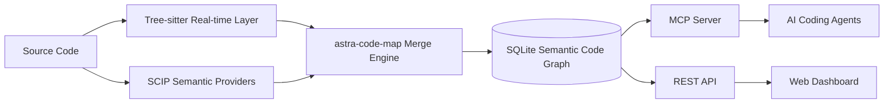

# astra-code-map — 面向 AI 编程代理的高精度语义代码地图

<p align="center">
  
</p>

<p align="center">
  <a href="LICENSE"></a>
  <a href="https://golang.org/"></a>
  <a href="THIRD_PARTY_NOTICES.md"></a>
</p>

**中文** | [English](README_EN.md)

> Semantic Code Map · Code Graph · Code Intelligence · MCP Server

astra-code-map 是一个本地优先、极速响应的**高精度语义代码地图与代码图谱引擎**，专为 Claude Code、Codex、Cursor 等新一代智能 AI 编程代理与工程团队打造。它能够深度解构复杂代码库，将庞大交错的源文件转化为 SQLite 承载的“高确定性符号拓扑网”，彻底终结 AI 因反复 `grep` 和盲目读取整文件而导致的上下文（Context）浪费。

除了为 AI Agent 注入高精度的代码空间感外，系统还内置了一个极具视觉震撼力的 **Web Dashboard**，将抽象的架构提炼为三种极佳的交互式阅读视界：
* 🪐 **探索视界 (Explore View)**：动态星图级的交互式文件目录，让开发者能够一键洞悉各个模块的层级深度与节点聚合度。
* 🕸️ **依赖拓扑 (Dependency Graphs)**：支持交互拉伸的全局与局部调用图谱，精准还原任意函数的 callers/callees 调用邻域与路径依赖。
* 📖 **理解文档 (Understanding Documents)**：自动生成的模块级与文件级语义说明书，结合源码片段与关系脉络，提供无与伦比的架构速读与交接体验。

---

### 核心技术优势：以 SCIP 语义为主，Tree-sitter 语法为辅

在大型复杂项目或工业级代码库中，单纯依靠语法层（Tree-sitter 等基于 AST 的文本解析）由于缺乏类型系统支持，在面对多态、接口实现、同名函数重载以及复杂的跨模块依赖时，会产生大量的符号歧义，导致代码地图的关系网严重失真。

为了解决这一本质痛点，AstraMap 确立了以 SCIP 编译器级语义为主导，Tree-sitter 语法级更新为辅助的**双层混合高精度架构**：



* **SCIP（高精度语义主导，决定图谱的上限）**：作为系统的**语义核心**。它利用编译器及语言工具链（如 LSP/LSIF/SCIP Provider）对项目进行完整的类型推导，生成**跨文件消歧**、**精准多态跳转**以及**完备接口映射**的高精度代码拓扑图。这是整个项目最核心的竞争优势和价值所在。
* **Tree-sitter（实时增量辅助，决定图谱的实时性）**：作为系统的**动态补丁**。在 SCIP 确立的高精度骨架之上，Tree-sitter 通过毫秒级的单文件 AST 解析，在文件变更时提供轻量级更新（如行号修正、新定义追加），从而避免了频繁执行全量编译和 SCIP 重建的昂贵开销。

---

### SCIP 解决了哪些纯 Tree-sitter 解决不了的问题？

在大型、多模块及类型系统复杂的工业级代码库中，如果**仅依靠 Tree-sitter（即单纯基于文本 AST 的正则/符号模式匹配）**，代码地图会面临以下不可逾越的痛点：

#### 1. 接口实现（Interface / Trait）的精准跨文件映射
* **Tree-sitter 痛点**：仅能通过名字做字面关联。如果项目中存在多个结构体/类实现了同一个 `Read` 或 `Close` 方法，纯 Tree-sitter 会导致调用图产生灾难性的多义关联（将调用点指向不相干的实现类），最终使影响面分析（Impact Analysis）爆发出铺天盖地的噪音。
* **SCIP 解决方案**：基于编译器的类型系统推导，AstraMap 能够精确定位接口声明与实际类型实现之间的绑定关系，调用图中的每条边均具备编译器级的确定性。

#### 2. 同名符号与函数重载的全局消歧
* **Tree-sitter 痛点**：在不同文件或模块中定义了同名的结构体或公共方法（例如 `pkgA.Init()` 与 `pkgB.Init()`），Tree-sitter 代码地图在分析 `Init()` 的调用者时，往往只能退化为“名字模糊匹配”，混淆调用链路。
* **SCIP 解决方案**：为每个符号生成全局唯一的全限定命名空间标识（U.N.S.），哪怕拼写完全一致，不同作用域、不同类型的符号也会在 SQLite 节点表中被严格区分开。

#### 3. 跨模块/跨库的深层依赖与第三方 SDK 边界追踪
* **Tree-sitter 痛点**：无法解析外部导入包、私有 SDK 以及隐藏在工具链中的符号调用链，调用图无法外延。
* **SCIP 解决方案**：自动加载外部依赖符号元数据，建立与第三方库、框架底座的清晰边界关联。

#### 4. 高确定性的变更影响分析（Impact Analysis）与死代码（Deadcode）检测
* **Tree-sitter 痛点**：由于充斥着“可能、也许”的启发式模糊连接，其生成的调用拓扑存在大量虚假连线，使得递归计算依赖影响范围时会迅速扩散至全库，失去指导重构或测试推荐的参考价值。
* **SCIP 解决方案**：以“确定性调用边”为基础构建强连通分量，支持高度可信的深度拓扑递归，能够准确指出“修改符号 X，在物理上传播的精准文件集合是 A、B、C”。

---

| 维度 | SCIP (高精度语义主导层) | Tree-sitter (语法辅助层) |
|---|---|---|
| **定位与角色** | **高精度跨文件语义核心** | **实时增量结构补丁** |
| **价值体现** | 消除多态与重载歧义，提供确定性的调用链、数据流分析及精准影响面评估。 | 保证编辑器/AI Agent 操作时的实时响应，纠正文件编辑后的符号偏移。 |
| **解析机理** | 结合编译器/构建系统，进行类型推导与符号消歧。 | 纯文本 AST 解析，无需编译，不依赖任何第三方构建工具。 |
| **更新频率** | 按需触发/定时批量生成（`amap index`），重构或大变更时更新。 | 实时监听（`amap watch` / 每次文件保存），毫秒级增量覆写到 SQLite。 |

#### 融合与消歧逻辑

在 AstraMap 的合并引擎（Merge Engine）中：
1. **SCIP 注入黄金语义**：SCIP 运行后，将高精度的跨文件调用和接口实现关系写入 SQLite，奠定图谱的精准度根基。
2. **Tree-sitter 提供实时纠偏**：在两次 SCIP 运行之间，Tree-sitter 通过覆盖层（Syntax Overlay）修正因开发者的编辑操作导致的符号行号漂移、新符号定义缺失等问题，保证图谱“虽有微小滞后但不失真”。
3. **降级保障**：在没有配置 SCIP 或构建环境不完备的开发边缘场景下，系统才临时退化到以 Tree-sitter 为基础的启发式推演。

---

## astra-code-map 能解决什么

| 你想知道的问题 | astra-code-map 提供的能力 |
|---|---|
| 某个函数、类型或方法在哪里定义？ | 语义符号搜索与精确定位 |
| 谁调用了这个函数？它又调用了谁？ | Callers / Callees 查询 |
| 两个模块之间是怎样关联的？ | 代码探索与调用路径追踪 |
| 修改某个符号会影响哪些文件和模块？ | 递归影响分析与 Git Diff 分析 |
| 大型仓库中哪些内容不应进入 AI 上下文？ | 生态感知过滤与生成文件排除 |
| 如何让 AI 用更少上下文理解代码库？ | MCP 结构化查询与按需源码片段 |

astra-code-map 不替代源码，也不替代编译器。它为 AI Agent、IDE 和研发平台提供一张**可查询、可追踪、可持续更新的代码导航底图**。

## 核心特性

- **语义代码地图**：统一组织函数、方法、类型、文件和模块，以及调用、引用、导入、继承和实现关系。
- **双层索引架构**：Tree-sitter 负责实时结构，SCIP Provider 负责跨文件语义与符号消歧。
- **增量同步**：基于文件状态和内容哈希更新变更文件，无需每次全量重建。
- **MCP 原生接入**：为 Claude Code、Codex、Cursor、VS Code 等客户端提供结构化代码查询工具。
- **调用与影响分析**：支持 callers、callees、路径追踪、递归影响传播、循环依赖和耦合分析。
- **本地可视化**：Web Dashboard 展示项目结构、调用邻域、源码片段和理解文档。
- **生态感知过滤**：自动排除依赖目录、构建产物、缓存、二进制文件和生成代码。
- **C/C++ 条件编译感知**：保留 `#if`、`#ifdef`、`#ifndef` 等守卫上下文。

## 界面预览

### 探索视界

从项目、目录、文件或函数进入，先观察全局结构，再逐层深入局部实现。


### 依赖关系

围绕目标函数查看调用者、被调用者和相关调用路径。


### 理解文档

生成函数、文件、模块和项目级结构化文档，辅助代码阅读、审查、重构和交接。


## 快速开始

完整的平台安装、SCIP Provider 配置和排障方法见 [QUICKSTART.md](QUICKSTART.md)。

### 1. 构建并安装

在 astra-code-map 仓库根目录执行：

```bash
./build.sh

mkdir -p "$HOME/.local/bin"
install -m 755 ./amap "$HOME/.local/bin/amap"
export PATH="$HOME/.local/bin:$PATH"
```

验证安装：

```bash
amap --help
```

> Go 版本要求以仓库中的 `go.mod` 为准。Windows 用户请构建 `amap.exe`，并将其所在目录加入用户 PATH。

### 2. 进入需要分析的项目

```bash
cd /path/to/your/project
```

### 3. 注册 MCP

```bash
amap install
```

该命令会探测本机已安装的客户端，并只为实际存在的客户端写入 astra-code-map MCP 配置。

### 4. 首次构建代码地图

```bash
amap index
```

首次运行会创建：

```text
.astra-code-map/
├── config.yaml
└── astra-code-map.db
```

### 5. 启动 Dashboard

```bash
amap dashboard
```

浏览器访问：

```text
http://localhost:3000
```

### 6. 持续同步（可选）

建议在独立终端中运行：

```bash
amap watch 30
```

不要同时启动多个 watcher，以免重复扫描和增加数据库写入。

## AI Agent 使用示例

完成 MCP 注册后，可以在 IDE编程工具问：测试代码地图，验证代码地图的有效性。


对应 MCP 工具：

| 工具 | 用途 |
|---|---|
| `astra-code-map_search` | 搜索函数、方法、类型及其他符号 |
| `astra-code-map_explore` | 围绕业务概念或符号探索相关文件和关系 |
| `astra-code-map_node` | 查看符号定义、签名、位置和源码片段 |
| `astra-code-map_callers` | 查询直接调用者 |
| `astra-code-map_callees` | 查询直接被调用者 |
| `astra-code-map_impact` | 递归分析变更影响范围 |
| `astra-code-map_trace` | 查找两个符号之间的调用路径 |
| `astra-code-map_status` | 查看索引覆盖与数据来源 |
| `astra-code-map_files` | 按目录或模式查询已索引文件 |


## 支持语言

Core 内置以下语言的 Tree-sitter 实时解析。安装相应 SCIP Provider 后，可获得更完整的跨文件语义。

| 语言 | 常见扩展名 | 语义 Provider | 实时解析 |
|---|---|---|---|
| Go | `.go` | `scip-go` | Tree-sitter |
| TypeScript | `.ts` `.tsx` | `scip-typescript` | Tree-sitter |
| JavaScript | `.js` `.jsx` `.mjs` `.cjs` | `scip-typescript` | Tree-sitter |
| Python | `.py` | `scip-python` | Tree-sitter |
| Java | `.java` | `scip-java` | Tree-sitter |
| Kotlin | `.kt` `.kts` | `scip-java` | Tree-sitter |
| Scala | `.scala` `.sc` | `scip-java` | Tree-sitter |
| C | `.c` `.h` | `scip-clang` | Tree-sitter |
| C++ | `.cc` `.cpp` `.cxx` `.hpp` `.hxx` | `scip-clang` | Tree-sitter |
| Rust | `.rs` | `scip-rust` | Tree-sitter |
| C# | `.cs` | `scip-dotnet` | Tree-sitter |
| Ruby | `.rb` `.rake` | `scip-ruby` | Tree-sitter |

SCIP Provider 是否可用，取决于对应项目、语言工具链和构建输入。例如，高精度 C/C++ 索引通常需要有效的 `compile_commands.json`。

## 常用 CLI

### 索引与服务

| 命令 | 说明 |
|---|---|
| `amap install` | 注册 MCP 到本机 AI 编程工具 |
| `amap index` | 构建或增量更新代码地图 |
| `amap index --tree-sitter` | 只使用 Tree-sitter 实时层 |
| `amap index --refresh-scip` | 强制刷新 SCIP 语义层 |
| `amap index --full` | 执行全量刷新 |
| `amap watch [seconds]` | 监听代码变化并持续同步 |
| `amap serve` | 启动 MCP stdio Server |
| `amap dashboard` | 启动 Web Dashboard |

### 导航与分析

| 命令 | 说明 |
|---|---|
| `amap locate <symbol>` | 定位符号定义 |
| `amap tree <symbol>` | 输出调用拓扑树 |
| `amap diff [--suggest-tests]` | 分析 Git 变更影响并建议测试范围 |
| `amap hotspots` | 查找代码热点 |
| `amap deadcode` | 检测不可达函数和方法 |
| `amap cycles` | 检测循环依赖 |
| `amap coupling [--path=...]` | 分析模块耦合 |
| `amap owners <symbol>` | 基于 Git blame 查询代码所有权 |
| `amap query "<SQL>"` | 直接查询本地 SQLite 代码图谱 |

## 生态感知过滤

astra-code-map 遵循一条默认原则：

> 代码地图优先索引手写的、承载业务语义的源代码。

系统会自动识别常见生态并排除：

- 版本控制元数据
- 第三方依赖目录
- 构建产物和缓存
- 生成代码与压缩文件
- 二进制文件和不可解析资源

用户可通过 `.astra-code-map/config.yaml` 使用 `include`、`exclude` 和 `force-include` 调整结果。

```yaml
index:
  languages:
    - go
  exclude:
    - "docs/**"
    - "vendor/**"
  include:
    - "src/**"
```

## 本地数据与隐私

astra-code-map 本身在本地读取和索引代码，并将数据保存在当前项目的 `.astra-code-map/` 目录中。

- astra-code-map 不要求将完整代码库上传到独立的远程索引服务。
- MCP Server 通过本地 stdio 向客户端提供结构化查询。
- Dashboard 和 REST API 默认服务于本地项目数据。
- AI 客户端是否会把查询结果发送到远程模型，取决于该客户端及模型服务的配置，不由 astra-code-map 控制。

不要将 `.astra-code-map/astra-code-map.db` 提交到 Git。建议在项目的 `.gitignore` 中加入：

```gitignore
.astra-code-map/
```

## 开源组件与许可证

astra-code-map 建立在成熟的开源生态之上，包括 SCIP、Tree-sitter、SQLite 相关组件、`sqlx`、`fsnotify`、D3.js 和 Marked 等。

- astra-code-map 自有源代码采用 [Apache License 2.0](LICENSE)，除非具体文件另有说明。
- 第三方组件继续适用其各自的版权声明和许可证。
- 完整的第三方组件、版本和许可证清单见 [THIRD_PARTY_NOTICES.md](THIRD_PARTY_NOTICES.md)。
- 发布包应同时包含 `LICENSES/` 中的许可证原文和对应版本生成的 SBOM。
- 外部 SCIP Provider 默认作为独立工具使用；除非 Release 明确说明，否则不随 astra-code-map 二进制一起分发。

README 中的组件列表仅用于说明主要技术构成，`THIRD_PARTY_NOTICES.md`、`LICENSES/` 和 Release SBOM 才是分发合规的权威清单。

## 项目状态

astra-code-map 仍在持续演进。公开接口、配置格式和索引数据结构在稳定版本之前可能发生变化。

适合当前阶段的使用方式：

- 在本地项目中验证语义代码地图能力
- 接入 AI 编程代理进行代码导航与影响分析
- 在真实仓库中反馈误索引、漏索引和跨文件关系问题
- 贡献新的测试样例、文档、平台适配和语言兼容性修复

## 参与贡献

提交 Issue 前，请尽量提供：

- 操作系统与 astra-code-map 版本
- 项目语言和构建工具
- 使用的 SCIP Provider 及版本
- 可复现的最小代码样例
- 实际结果与期望结果

提交代码前，请先通过 Issue 说明问题背景和预期方案。安全问题不要在公开 Issue 中披露敏感细节。

## 更新日志

详情见完整 [CHANGELOG.md](CHANGELOG.md)。

### [v0.2.0] - 2026-07-30
- 🚀 **架构确立**：确立“SCIP 高精度语义为主，Tree-sitter 实时语法为辅”的双层混合架构。
- ⚡ **Watch 增量防抖**：`amap watch` 隔离高频 SCIP 编译，增加 2 分钟静默防抖收敛机制。
- 🎯 **启发式消歧**：引入物理同包路径优先过滤、拦截 Go `init()` 隐式调用、强化 `obj.Method()` 盲连防御。

## 相关文档

- [快速部署](QUICKSTART.md)
- [更新日志](CHANGELOG.md)
- [第三方软件声明](THIRD_PARTY_NOTICES.md)

## License

Licensed under the Apache License, Version 2.0. See [LICENSE](LICENSE) for details.
