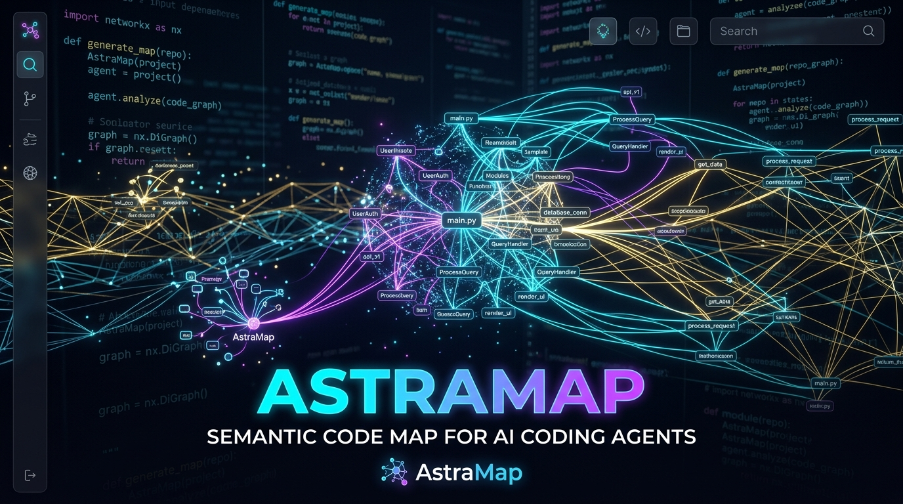
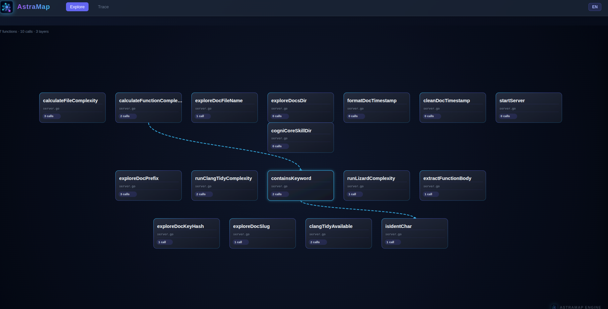
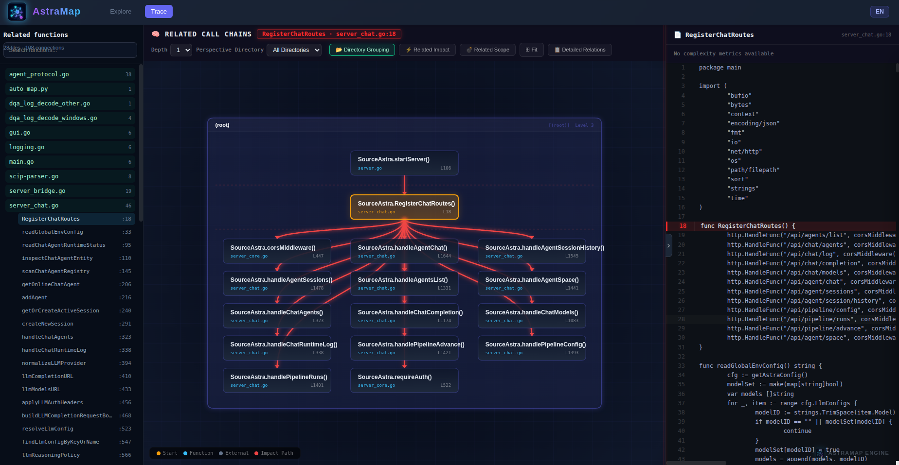
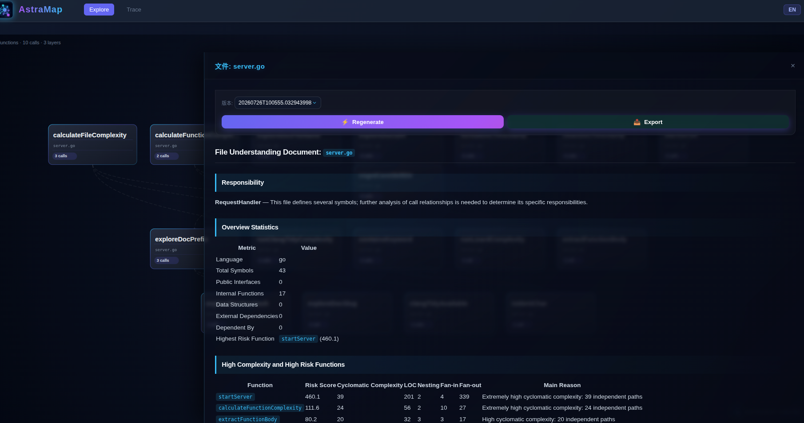
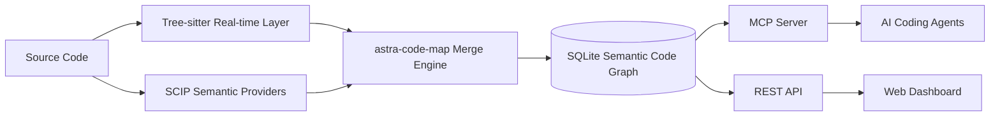

# astra-code-map — Semantic Code Map for AI Coding Agents

<p align="center">
  
</p>

<p align="center">
  <a href="LICENSE"></a>
  <a href="https://golang.org/"></a>
  <a href="THIRD_PARTY_NOTICES.md"></a>
</p>

[中文](README.md) | **English**

> Semantic Code Map · Code Graph · Code Intelligence · MCP Server

astra-code-map is a local-first **semantic code map and code graph engine** for Claude Code, Codex, Cursor, and other MCP-compatible AI coding tools.

It turns a codebase into queryable symbol nodes and semantic edges, allowing AI agents to locate definitions, trace calls, explore dependencies, and analyze change impact without repeatedly scanning entire files with `grep`.

```text
Source code
  ├─ Tree-sitter: fast parsing of the current file structure
  └─ SCIP: cross-file, type-aware final semantics
          ↓
      astra-code-map merge engine
          ↓
 SQLite Semantic Code Graph
          ↓
 MCP Server · REST API · Web Dashboard
```

## What astra-code-map Helps Answer

| Question | astra-code-map capability |
|---|---|
| Where is a function, type, or method defined? | Semantic symbol search and precise location |
| Who calls this function, and what does it call? | Callers and callees queries |
| How are two modules connected? | Code exploration and call-path tracing |
| What could be affected by changing a symbol? | Recursive impact analysis and Git diff analysis |
| What should be excluded from AI context in a large repository? | Ecosystem-aware filtering and generated-file exclusion |
| How can an agent understand a codebase with less context? | Structured MCP queries and on-demand source snippets |

astra-code-map does not replace source code or language toolchains. It provides AI agents, IDEs, and engineering platforms with a **queryable, traceable, continuously updated code-navigation foundation**.

## Highlights

- **Semantic code map** for functions, methods, types, files, modules, calls, references, imports, inheritance, and implementations.
- **Two-layer indexing** with Tree-sitter for real-time structure and SCIP Providers for cross-file semantics and symbol disambiguation.
- **Incremental synchronization** based on file state and content hashes.
- **MCP-native integration** for Claude Code, Codex, Cursor, VS Code, and other compatible clients.
- **Call and impact analysis** including callers, callees, path tracing, recursive impact, dependency cycles, and coupling.
- **Local visualization** through a Web Dashboard for structure, call neighborhoods, source snippets, and generated understanding documents.
- **Ecosystem-aware filtering** for dependencies, build outputs, caches, binaries, and generated source.
- **C/C++ conditional-compilation awareness** for `#if`, `#ifdef`, and `#ifndef` context.

## Screenshots

### Explore View

Start from a project, directory, file, or symbol and move from global structure to local implementation.



### Dependency View

Inspect callers, callees, and related call paths around a target function.



### Understanding Documents

Generate structured function-, file-, module-, and project-level documents for code reading, review, refactoring, and handover.



## Quick Start

See [QUICKSTART_EN.md](QUICKSTART_EN.md) for platform-specific installation, SCIP Provider setup, and troubleshooting.

### 1. Build and install

Run from the astra-code-map repository root:

```bash
./build.sh

mkdir -p "$HOME/.local/bin"
install -m 755 ./amap "$HOME/.local/bin/amap"
export PATH="$HOME/.local/bin:$PATH"
```

Verify the installation:

```bash
amap --help
```

> Use the Go version required by `go.mod`. On Windows, build `amap.exe` and add its directory to the user PATH.

### 2. Enter the project to analyze

```bash
cd /path/to/your/project
```

### 3. Register MCP

```bash
amap install
```

The command detects installed clients and writes astra-code-map MCP configuration only for clients that are actually present.

### 4. Build the first code map

```bash
amap index
```

The first run creates:

```text
.astra-code-map/
├── config.yaml
└── astra-code-map.db
```

### 5. Launch the Dashboard

```bash
amap dashboard
```

Open:

```text
http://localhost:3000
```

### 6. Keep the map synchronized (optional)

Run in a dedicated terminal:

```bash
amap watch 30
```

Avoid running multiple watchers for the same project.

## AI Agent Examples

After MCP registration, ask your AI coding tool questions such as:

```text
Where is handleRequest defined?
Who calls handleRequest?
What functions does handleRequest depend on?
What modules could be affected by changing auth.ValidateToken?
What is the call path from an HTTP route to a database write?
List the indexed files under src/network.
```

MCP tools:

| Tool | Purpose |
|---|---|
| `astra-code-map_search` | Search functions, methods, types, and other symbols |
| `astra-code-map_explore` | Explore files and relationships around a concept or symbol |
| `astra-code-map_node` | Read symbol definition, signature, location, and source snippet |
| `astra-code-map_callers` | Query direct callers |
| `astra-code-map_callees` | Query direct callees |
| `astra-code-map_impact` | Analyze recursive change impact |
| `astra-code-map_trace` | Find a call path between two symbols |
| `astra-code-map_status` | Inspect index coverage and provenance |
| `astra-code-map_files` | Query indexed files by path or pattern |

## Architecture Overview

astra-code-map combines real-time structure with final semantic information.



### Tree-sitter real-time layer

- Parses the current files quickly
- Extracts definitions, signatures, comments, and local calls
- Supports file-level incremental updates
- Provides a usable baseline when no SCIP Provider is available

### SCIP semantic layer

- Provides cross-file definitions and references
- Resolves type relationships, implementations, and overloaded symbols
- Improves determinism for call graphs and impact analysis
- Is enabled selectively based on language and build environment

### Merge and storage

All nodes and edges retain provenance information and are stored in a local SQLite database. MCP, REST, and the Dashboard share the same data instead of maintaining separate indexes.

## Supported Languages

Core includes built-in Tree-sitter parsing for the following languages. Install the corresponding SCIP Provider for richer cross-file semantics.

| Language | Common extensions | Semantic Provider | Real-time parsing |
|---|---|---|---|
| Go | `.go` | `scip-go` | Tree-sitter |
| TypeScript | `.ts` `.tsx` | `scip-typescript` | Tree-sitter |
| JavaScript | `.js` `.jsx` `.mjs` `.cjs` | `scip-typescript` | Tree-sitter |
| Python | `.py` | `scip-python` | Tree-sitter |
| Java | `.java` | `scip-java` | Tree-sitter |
| Kotlin | `.kt` `.kts` | `scip-java` | Tree-sitter |
| Scala | `.scala` `.sc` | `scip-java` | Tree-sitter |
| C | `.c` `.h` | `scip-clang` | Tree-sitter |
| C++ | `.cc` `.cpp` `.cxx` `.hpp` `.hxx` | `scip-clang` | Tree-sitter |
| Rust | `.rs` | `scip-rust` | Tree-sitter |
| C# | `.cs` | `scip-dotnet` | Tree-sitter |
| Ruby | `.rb` `.rake` | `scip-ruby` | Tree-sitter |

SCIP availability depends on the project, language toolchain, and build inputs. For example, high-precision C/C++ indexing commonly requires a valid `compile_commands.json`.

## Common CLI Commands

### Indexing and services

| Command | Description |
|---|---|
| `amap install` | Register MCP with local AI coding tools |
| `amap index` | Build or incrementally update the code map |
| `amap index --tree-sitter` | Use only the Tree-sitter real-time layer |
| `amap index --refresh-scip` | Force a SCIP semantic refresh |
| `amap index --full` | Perform a full refresh |
| `amap watch [seconds]` | Watch code changes and synchronize continuously |
| `amap serve` | Start the MCP stdio server |
| `amap dashboard` | Start the Web Dashboard |

### Navigation and analysis

| Command | Description |
|---|---|
| `amap locate <symbol>` | Locate a symbol definition |
| `amap tree <symbol>` | Print a call-topology tree |
| `amap diff [--suggest-tests]` | Analyze Git change impact and suggest test scope |
| `amap hotspots` | Find code hotspots |
| `amap deadcode` | Detect unreachable functions and methods |
| `amap cycles` | Detect dependency cycles |
| `amap coupling [--path=...]` | Analyze module coupling |
| `amap owners <symbol>` | Query code ownership using Git blame |
| `amap query "<SQL>"` | Query the local SQLite code graph directly |

## Ecosystem-Aware Filtering

astra-code-map follows a simple default principle:

> Prefer hand-written source code that carries business meaning.

It automatically excludes common categories such as:

- Version-control metadata
- Third-party dependency directories
- Build outputs and caches
- Generated source and compressed assets
- Binary files and unsupported resources

Use `include`, `exclude`, and `force-include` in `.astra-code-map/config.yaml` to adjust the result.

```yaml
index:
  languages:
    - go
  exclude:
    - "docs/**"
    - "vendor/**"
  include:
    - "src/**"
```

## Local Data and Privacy

astra-code-map reads and indexes code locally and stores project data under `.astra-code-map/`.

- astra-code-map does not require uploading the complete repository to a separate remote indexing service.
- The MCP Server exposes structured queries through local stdio.
- The Dashboard and REST API operate on local project data.
- Whether an AI client sends returned context to a remote model depends on that client and model configuration, not astra-code-map.

Do not commit `.astra-code-map/astra-code-map.db`. Add the following to the target project's `.gitignore`:

```gitignore
.astra-code-map/
```

## Open-Source Components and Licensing

astra-code-map builds on open-source projects including SCIP, Tree-sitter, SQLite-related components, `sqlx`, `fsnotify`, D3.js, and Marked.

- astra-code-map-owned source code is licensed under the [Apache License 2.0](LICENSE), unless a file states otherwise.
- Third-party components remain under their respective copyrights and licenses.
- See [THIRD_PARTY_NOTICES.md](THIRD_PARTY_NOTICES.md) for component, version, and license information.
- Release archives should include license texts under `LICENSES/` and a version-specific SBOM.
- External SCIP Providers are normally used as separate tools and are not bundled with astra-code-map unless a release explicitly states otherwise.

The component names in this README are an architectural overview. `THIRD_PARTY_NOTICES.md`, `LICENSES/`, and the release SBOM are the authoritative distribution records.

## Project Status

astra-code-map is under active development. Public APIs, configuration formats, and index storage may change before a stable release.

Current uses include:

- Evaluating semantic code-map capabilities on local projects
- Connecting AI coding agents for navigation and impact analysis
- Reporting false positives, missing symbols, and cross-file relationship issues
- Contributing test cases, documentation, platform support, and language fixes

## Contributing

Before opening an issue, please include:

- Operating system and astra-code-map version
- Project language and build tool
- SCIP Provider and version, when applicable
- A minimal reproducible code sample
- Actual and expected behavior

Before submitting code, open an Issue describing the problem and the proposed approach. Do not disclose sensitive security details in a public Issue.

## Documentation

- [Quick Start](QUICKSTART_EN.md)
- [Third-Party Notices](THIRD_PARTY_NOTICES.md)

## License

Licensed under the Apache License, Version 2.0. See [LICENSE](LICENSE) for details.
