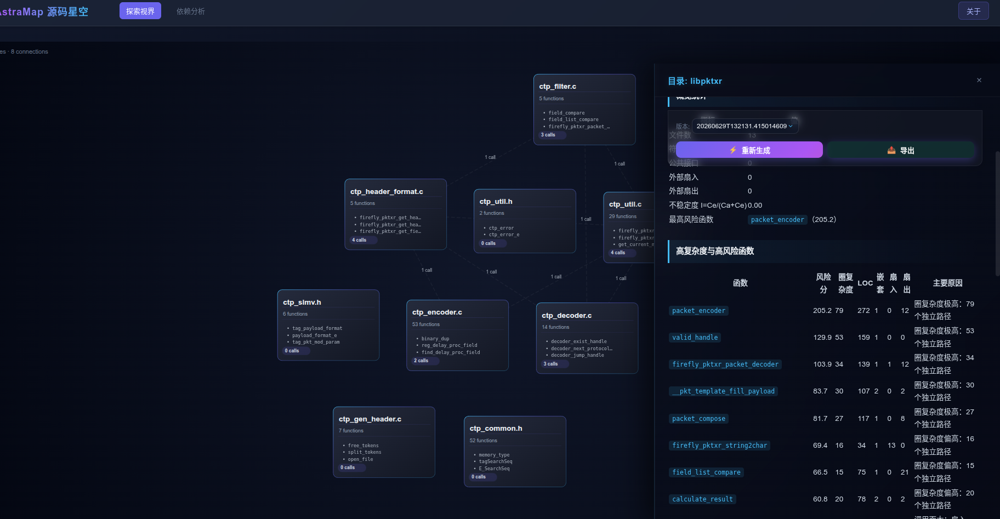
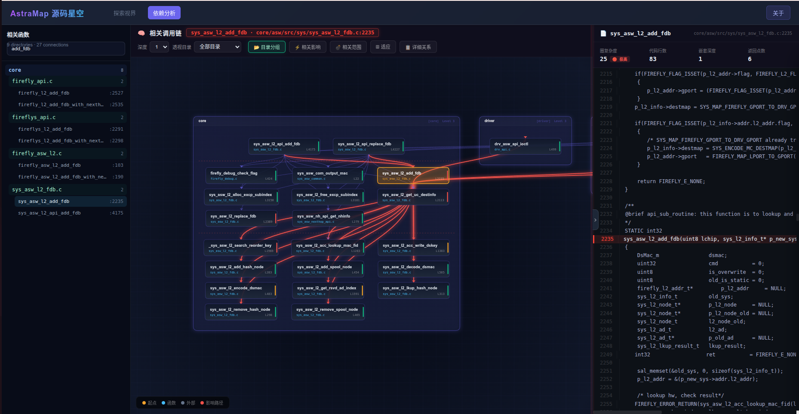
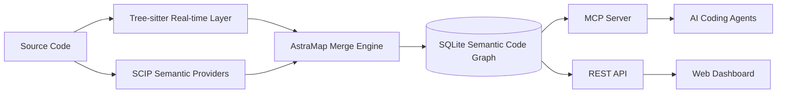

# AstraMap — Semantic Code Map & Code Graph for AI Coding Agents

[中文](README.md) | **English**

> Semantic Code Map · Code Graph · Code Intelligence · MCP Server

AstraMap is a high-precision semantic code map engine built for **Claude Code, Codex, Cursor, and other AI coding agents**. It combines **SCIP compiler-grade semantics** with **Tree-sitter real-time parsing** to transform an entire codebase into a queryable graph of symbols and relationships, enabling precise code navigation, call-chain tracing, dependency analysis, change-impact analysis, and token-efficient context retrieval.

```text
Source Code → Tree-sitter Real-time Layer + SCIP Semantic Layer → SQLite Code Graph → MCP / REST API → AI Agents / Dashboard
```

## Why AstraMap

AI coding agents commonly rely on `grep`, file search, and repeated source reads to understand a large repository. That approach consumes context quickly and can miss cross-file calls, interface implementations, overloads, and indirect dependencies.

AstraMap pre-builds the repository as a queryable **Semantic Code Graph**:

| Engineering question | Traditional approach | AstraMap |
|---|---|---|
| Where is this function defined? | Search by name and inspect files manually | `astramap_search` / `astramap_node` |
| Who calls this function? | Multiple grep passes and manual disambiguation | `astramap_callers` |
| What could this change affect? | Manually trace calls and module dependencies | `astramap_impact` / `amap diff` |
| How are two modules connected? | Read multiple directories and entry points | `astramap_explore` / `astramap_trace` |
| Where are the code-health risks? | Run and combine several analysis tools | `amap hotspots` / `deadcode` / `cycles` |

AstraMap does not replace source code. It provides AI agents and developers with a **precise, current, and traceable navigation layer over the codebase**.

## Core Capabilities

| Capability | Description |
|---|---|
| **Semantic code map** | Models functions, methods, types, files, and modules as nodes, with calls, references, inheritance, implementations, and imports as edges |
| **Compiler-grade cross-file semantics** | Uses SCIP for cross-file references, calls, type information, implementation edges, and symbol disambiguation |
| **Real-time incremental updates** | Uses Tree-sitter to reflect current on-disk code and updates changed files by hash without re-indexing the entire repository |
| **MCP server** | Exposes structured code-navigation tools to Claude Code, Codex, Cursor, and other MCP-compatible clients |
| **Call graphs and impact analysis** | Supports callers, callees, call paths, recursive impact propagation, dependency graphs, and coupling analysis |
| **Code-understanding documents** | Generates function-, file-, module-, and project-level documentation with complexity and architecture-risk insights |
| **Large-repository filtering** | Automatically excludes dependencies, build artifacts, caches, generated code, binaries, and other non-business source files |
| **C/C++ conditional-awareness** | Annotates `#if`, `#ifdef`, and `#ifndef` guards on graph edges so call relationships retain their conditional context |

## Interactive Code Graph

The Dashboard and MCP Server share the same SQLite semantic graph. Search, navigation, source preview, call tracing, and generated documentation all use the same symbol identities.

### Explore View

Start from a project, directory, file, or function, then move from global structure into local implementation details.



### Dependency View

Expand the full call neighborhood around a target function, including callers, callees, ancestors, descendants, and related nodes.



### Understanding Documents

Generate structured documentation at function, file, module, and project granularity for code reading, review, refactoring, and handover.


## How It Works

AstraMap uses a two-layer architecture: **Tree-sitter for real-time structure and SCIP for final semantic precision**.

```text
SCIP semantic layer
  └─ cross-file calls, definitions and references, types, implementations, symbol disambiguation

Tree-sitter real-time layer
  └─ current file structure, signatures, comments, local calls, incremental changes

Merge engine
  └─ stable symbol identity, provenance tracking, conflict handling, semantic convergence

SQLite code graph
  └─ nodes + edges + files + FTS5 full-text search
```



Tree-sitter parses current files quickly, but it cannot reliably resolve complex cross-file relationships by itself. SCIP is produced by language toolchains and provides more deterministic cross-file semantics. AstraMap merges both sources so code changes appear quickly while compiler-grade relationships remain the semantic baseline.

## Quick Start

This is the shortest reliable deployment path for the current repository. See [QUICKSTART.md](QUICKSTART.md) for platform notes, continuous synchronization, and troubleshooting.

### 1. Build and install the CLI

```bash
go build -o amap ./cmd/amap

mkdir -p "$HOME/.local/bin"
install -m 755 ./amap "$HOME/.local/bin/amap"
export PATH="$HOME/.local/bin:$PATH"
```

Add the following line to `~/.bashrc` or `~/.zshrc`:

```bash
export PATH="$HOME/.local/bin:$PATH"
```

Verify the installation:

```bash
amap --help
```

### 2. Enter a target repository and register MCP

```bash
cd /path/to/your/project
amap install
```

`amap install` detects installed clients such as Claude Code, Codex, Cursor, VS Code, Windsurf, and Antigravity, then writes configuration only for clients that are actually available.

### 3. Build the code map

```bash
amap index
```

If SCIP Providers are not installed yet, start with the built-in Tree-sitter real-time layer:

```bash
amap index --tree-sitter
```

The first run creates `.astramap/config.yaml`. Later `amap index` runs reuse the selected languages and filtering configuration.

### 4. Launch the Dashboard

```bash
amap dashboard
```

Then open:

```text
http://localhost:3000
```

### 5. Keep the graph synchronized (optional)

Run the watcher in a dedicated terminal to avoid accidentally creating multiple background processes:

```bash
amap watch 30
```

Common indexing modes:

```bash
amap index --tree-sitter      # Tree-sitter real-time layer only
amap index --refresh-scip     # Force SCIP semantic refresh
amap index --full             # Full refresh
amap index --scip index.scip  # Import an existing SCIP index
```


## AI Agent Workflows

After MCP registration, an AI agent can query the repository through structured tools instead of repeatedly scanning files.

| Example question | AstraMap tool |
|---|---|
| “Where is `handleRequest` defined?” | `astramap_search`, `astramap_node` |
| “Who calls `handleRequest`?” | `astramap_callers` |
| “Which functions does it call?” | `astramap_callees` |
| “Which modules could be affected by changing it?” | `astramap_impact` |
| “How does authentication flow from the entry point to the database?” | `astramap_explore`, `astramap_trace` |
| “Is the current repository fully indexed?” | `astramap_status` |
| “List indexed files under `src/network`.” | `astramap_files` |

### MCP Tools

| Tool | Purpose |
|---|---|
| `astramap_search` | Fuzzy-search functions, methods, types, and other symbols |
| `astramap_explore` | Explore files, code, and relationships around a concept or symbol |
| `astramap_node` | Resolve symbol definitions, signatures, locations, source, and relationships |
| `astramap_callers` | Query direct callers |
| `astramap_callees` | Query direct callees |
| `astramap_impact` | Recursively analyze the potential impact of a change |
| `astramap_trace` | Find a call path between two symbols |
| `astramap_status` | Inspect index coverage, file status, and provenance |
| `astramap_files` | Query indexed files by path or pattern |

## Supported Languages

Core includes Tree-sitter real-time parsing for 12 languages. Corresponding SCIP providers add richer cross-file semantics when available.

| Language | Extensions | Semantic Provider | Built-in Real-time Parsing |
|---|---|---|---|
| Go | `.go` | `scip-go` | Tree-sitter |
| TypeScript | `.ts` `.tsx` | `scip-typescript` | Tree-sitter |
| JavaScript | `.js` `.jsx` `.mjs` `.cjs` | `scip-typescript` | Tree-sitter |
| Python | `.py` | `scip-python` | Tree-sitter |
| Java | `.java` | `scip-java` | Tree-sitter |
| Kotlin | `.kt` `.kts` | `scip-java` | Tree-sitter |
| Scala | `.scala` `.sc` | `scip-java` | Tree-sitter |
| C | `.c` `.h` | `scip-clang` | Tree-sitter |
| C++ | `.cc` `.cpp` `.cxx` `.hpp` `.hxx` | `scip-clang` | Tree-sitter |
| Rust | `.rs` | `scip-rust` | Tree-sitter |
| C# | `.cs` | `scip-dotnet` | Tree-sitter |
| Ruby | `.rb` `.rake` | `scip-ruby` | Tree-sitter |

External Syntax Overlays may replace the built-in parser implementation for an existing language, but they do not extend Core's language registry, project-unit model, or semantic-provider boundaries.

```bash
./amap syntax install --trust-key ./trusted-keys.json ./language-syntax.amaplang
./amap syntax list
./amap syntax doctor ruby
```

## CLI Reference

### Core Services

| Command | Description |
|---|---|
| `amap serve` | Start the stdio MCP Server |
| `amap dashboard` | Start the Web Dashboard |
| `amap index` | Build or incrementally update the code map |
| `amap watch [seconds]` | Watch source changes and keep the graph synchronized |
| `amap install` | Register the MCP Server with AI coding tools |

### Navigation and Code Analysis

| Command | Description |
|---|---|
| `amap locate <symbol>` | Locate a symbol definition |
| `amap diff [--suggest-tests]` | Analyze Git change impact and suggest a test scope |
| `amap tree <symbol>` | Print a call-topology tree |
| `amap hotspots` | Find high-risk code hotspots |
| `amap deadcode` | Detect unreachable functions and methods |
| `amap cycles` | Detect cyclic dependencies |
| `amap coupling [--path=...]` | Analyze afferent and efferent module coupling |
| `amap owners <symbol>` | Query code ownership from Git blame |
| `amap query "<SQL>"` | Query the SQLite code graph directly |

## REST API

The Dashboard also exposes a REST JSON API for IDEs, internal developer platforms, and automation systems.

Main endpoints include:

```text
/api/astramap/status
/api/astramap/search
/api/astramap/node/{id}
/api/astramap/callers/{id}
/api/astramap/callees/{id}
/api/astramap/impact/{id}
/api/astramap/explore
/api/astramap/trace
/api/astramap/overview
/api/astramap/functions
/api/astramap/data
/api/graph/module
/api/documents/generate
```

## Ecosystem-Aware Filtering

AstraMap follows one principle: **the code map should index handwritten source code that carries business semantics**.

It detects common ecosystems and excludes dependencies, caches, build outputs, and generated files by default:

| Ecosystem | Detection Marker | Typical Auto-exclusions |
|---|---|---|
| Go | `go.mod` | `vendor/`, Go caches |
| Node.js | `package.json` | `node_modules/`, `dist/`, `.next/`, `coverage/` |
| Rust | `Cargo.toml` | `target/` |
| Maven / Gradle | `pom.xml`, `build.gradle` | `target/`, `.gradle/`, `build/` |
| CMake | `CMakeLists.txt` | `build/`, `cmake-build-*/` |
| Python | `pyproject.toml` | `__pycache__/`, `.venv/`, `*.egg-info/` |
| Bazel | `WORKSPACE` | `bazel-*/` |

Built-in rules also cover version-control metadata, binaries, archives, minified assets, and generated source marked with `generated` or `DO NOT EDIT`. Users can override defaults through include, exclude, and force-include rules in `.astramap/config.yaml`.

## Performance and Storage

AstraMap uses SQLite WAL, FTS5, memory mapping, query caches, and batched symbol resolution to support incremental indexing and concurrent reads on large repositories.

| Project Size | Reference Index Size | Reference Index Time |
|---|---:|---:|
| 10K lines | 2–4 MB | under 5 seconds |
| 100K lines | 12–20 MB | 10–30 seconds |
| 500K lines | 50–100 MB | 1–3 minutes |

> Actual results depend on language, symbol density, semantic provider, disk performance, and build environment. Before a formal release, consider adding reproducible benchmarks based on public repositories.

## Where AstraMap Fits

AstraMap is designed for:

- Providing repository-level semantic context to AI coding agents
- Building code navigation, code understanding, and code Q&A capabilities
- Analyzing call graphs, dependency graphs, and change impact
- Supporting legacy-code reading, review, refactoring, and test design
- Integrating code-graph capabilities into IDEs, engineering platforms, or multi-agent systems

Related search terms: `semantic code map`, `code graph`, `code intelligence`, `codebase intelligence`, `MCP server`, `AI coding agent`, `call graph`, `dependency graph`, `impact analysis`, `SCIP`, and `Tree-sitter`.

## License

© 2025–2026 He Zhichuan · AstraMap v0.3
