# AstraMap — SourceAstra 智能代码地图设计方案

> **定位**：以 MCP（Model Context Protocol）插件形态，为 Claude / Codex / Antigravity 等 AI 编程代理提供「语义级代码知识图谱」服务，将纯文本代码库转化为 **节点 + 边** 的全景关系地图，实现函数级精准定位和极致 Token 压缩。

---

## 1. 第一性原理：为什么需要 AstraMap

### 1.1 核心矛盾

| 维度 | 无代码地图 | 有代码地图 |
|------|-----------|-----------|
| 定位一个函数 | `grep` → Read 文件 → 判断上下文 ≈ **3-5 次工具调用，消耗 5K-20K Token** | `astramap_node symbol=foo` → **1 次调用，≈800 Token** |
| 理解调用链 | 反复 grep + Read ≈ **10-20 次调用** | `astramap_explore query="auth flow"` → **1 次调用** |
| 影响分析 | 几乎不可能精确完成 | `astramap_impact symbol=handleRequest` → 递归传播图 |

**结论**：代码地图将 AI Agent 的 Token 消耗降低 **60-80%**，同时将准确率从依赖正则匹配的 ≈70% 提升到 SCIP 语义精度的 **95%+**。

### 1.2 SourceAstra 的双重价值

```
┌─────────────────────────────────────────────┐
│              SourceAstra 部署               │
│                                             │
│  ┌──────────────┐    ┌──────────────────┐   │
│  │  AstraMap     │    │  代码治理引擎      │   │
│  │  (MCP 插件)   │    │  (审计/评审/质量)   │   │
│  │              │    │                  │   │
│  │  → 代码地图   │◄──►│  → 复杂度分析     │   │
│  │  → 降 Token  │    │  → Pipeline 评审  │   │
│  │  → 精准导航   │    │  → Bug 追踪       │   │
│  └──────────────┘    └──────────────────┘   │
│         ▲                    ▲               │
│         │   共享 SQLite DB   │               │
│         └────────┬───────────┘               │
│                  │                           │
│         ┌────────┴─────────┐                 │
│         │  symbols + edges │                 │
│         │  (知识图谱存储)    │                 │
│         └──────────────────┘                 │
└─────────────────────────────────────────────┘
```

---

## 2. 系统架构

### 2.1 系统拓扑与数据流向

```mermaid
graph TD
    A[源代码库] -->|compile_commands.json / go.mod| B[SCIP 索引生成器]
    C[条件配置矩阵 Matrix.json] -->|控制参数| B
    A -->|源码文件| D2[Tree-sitter 增量解析器]
    B -->|index.scip| D[SourceAstra 融合引擎]
    D2 -->|动态补丁| D
    D -->|多配置合并/去重| E[(SQLite 语义知识库)]

    F[AstraMap MCP Server] -->|SQL 递归查询| E
    G[LLM 智能代理 / IDE] -->|MCP 接口请求| F
    F -->|build_context 投影| H[条件分支代码投影器]
    H -->|剪裁后的代码| G

    style E fill:#1e1b4b,stroke:#818cf8,stroke-width:2px
    style F fill:#0f172a,stroke:#2dd4bf,stroke-width:2px
    style H fill:#1a1a2e,stroke:#e94560,stroke-width:2px
```



### 2.2 "SCIP 高精源 + Tree-sitter 动态补丁" 双轨融合模型

```
                    索引构建流程
                    ═══════════

  ┌─────────────────┐         ┌─────────────────┐
  │   SCIP 索引      │         │  Tree-sitter     │
  │   (静态高精度)     │         │  (实时动态补丁)    │
  │                 │         │                 │
  │  scip-clang     │         │  Go/WASM 解析器   │
  │  scip-go        │         │  增量文件扫描      │
  │  scip-java      │         │  实时补丁生成      │
  │  scip-typescript│         │                 │
  └────────┬────────┘         └────────┬────────┘
           │                          │
           │  provenance: "scip"      │  provenance: "tree-sitter"
           │                          │
           ▼                          ▼
  ┌─────────────────────────────────────────────┐
  │           融合引擎 (Merge Engine)             │
  │                                             │
  │  规则: SCIP 边 > Tree-sitter 边 (同源冲突)    │
  │        Tree-sitter 补充 SCIP 未覆盖的文件      │
  │        边的 provenance 字段标记数据来源         │
  └──────────────────┬──────────────────────────┘
                     │
                     ▼
  ┌─────────────────────────────────────────────┐
  │           SQLite 知识图谱存储                  │
  │                                             │
  │  nodes: id, kind, name, qualified_name,     │
  │         file_path, language, start_line,     │
  │         end_line, signature, docstring,      │
  │         visibility, return_type              │
  │                                             │
  │  edges: source, target, kind, provenance,   │
  │         line, column                        │
  │                                             │
  │  files: path, content_hash, language,       │
  │         indexed_at                          │
  │                                             │
  │  FTS5 全文索引: nodes_fts(name, qualified_name,│
  │                docstring, signature)         │
  └─────────────────────────────────────────────┘
```

### 2.3 数据模型

#### 节点类型 (NodeKind)

| Kind | 描述 | SCIP 来源 | Tree-sitter 来源 |
|------|------|----------|-----------------|
| `file` | 源文件 | ✓ Document | ✓ 文件扫描 |
| `function` | 函数 | ✓ Method/Function | ✓ function_definition |
| `method` | 方法 | ✓ Method | ✓ method_declaration |
| `class` | 类 | ✓ Class | ✓ class_declaration |
| `struct` | 结构体 | ✓ Struct | ✓ struct_specifier |
| `interface` | 接口 | ✓ Interface | ✓ interface_declaration |
| `variable` | 变量 | ✓ Variable/Field | ✓ variable_declarator |
| `constant` | 常量 | ✓ Constant | ✓ const_declaration |
| `enum` | 枚举 | ✓ Enum | ✓ enum_specifier |
| `module` | 模块/包 | ✓ Package/Namespace | ✓ 目录推断 |
| `macro` | 宏定义 | ✓ Macro | ✓ #define 行 |
| `import` | 导入声明 | ✓ | ✓ import_statement |

#### 边类型 (EdgeKind)

| Kind | 描述 | 语义 |
|------|------|------|
| `calls` | 函数调用 | A 调用 B |
| `contains` | 包含关系 | file→class, class→method |
| `imports` | 导入 | file A imports file B |
| `extends` | 继承 | class A extends class B |
| `implements` | 实现 | class A implements interface B |
| `references` | 引用 | 通用引用关系 |
| `type_of` | 类型标注 | variable 的类型是 class X |
| `returns` | 返回类型 | function 返回 type X |
| `overrides` | 重写 | method A overrides method B |
| `conditional_calls` | 条件调用 | A 在条件 C 下调用 B（C/C++ `#ifdef`、Go build tags、Rust `cfg` 等条件分支） |

### 2.4 与现有 SourceAstra 的集成点及交互细节

```
现有 SourceAstra 模块          AstraMap 复用/扩展
═══════════════════          ═════════════════

scip-parser.go               → 核心索引源 (SCIP → nodes/edges)
  parseScipIndex()              增强: 输出到 SQLite 而非 data.json
  extractSymbolInfo()           复用: NodeKind 映射

storage.go                   → 共享 SQLite DB
  schemaDDL (symbols/edges)     扩展: 新增 AstraMap 专用表
  withDB[T]()                   复用: 数据库操作包装器

trace.go                     → 调用链追踪
  TreeNode / FlattenResult      复用: 层次结构和扁平化
  flattenSymbols()              复用: 递归符号收集

server.go                    → HTTP API 入口
  /api/trace/*                  扩展: 新增 /api/astramap/* 端点

toolchain.go                 → SCIP 工具链管理
  BuildScipIndex()              复用: 触发 SCIP 索引构建

main.go                      → 数据结构
  Symbol / Edge / Output        扩展: 新增 AstraMap 专用类型
```

#### 2.4.1 核心文件交互细节

1. **[storage.go](file:///home/he/SourceAstra/storage.go)**
   - **交互点**：连接数据库初始化
   - **具体细节**：在 `OpenDB`（单连接模式）和 `OpenDBPair`（读写分离模式）中引入 `astramap.InitAstraMapSchema(db)`，在每次服务启动或连接初始化时自动迁移并保证 `astramap_nodes`、`astramap_edges`、`astramap_files`、`astramap_fts`（全文索引）和 `astramap_verdicts` 表的建立。使得代码地图图谱能与 SourceAstra 的主业务表（`complexity_metrics`, `jobs`）无缝共享同一个 SQLite 底层连接，确保了事务隔离性。

2. **[server_astramap.go](file:///home/he/SourceAstra/server_astramap.go) 与 [server.go](file:///home/he/SourceAstra/server.go)**
   - **交互点**：Web REST APIs 挂载
   - **具体细节**：在主服务器 `server.go` 中启动 HTTP 路由监听时，调用 `RegisterAstraMapRoutes()`。该方法注册了 `/api/astramap/*` 路由端点（如 `status`、`search`、`node`、`callers`、`callees`、`impact`、`explore`），使 SourceAstra 网页前端能向后端并发请求并直观呈现拓扑代码地图，而内部具体业务完全调用并解耦至 `astramap` 子包。

3. **[cmd/mcp/main.go](file:///home/he/SourceAstra/cmd/mcp/main.go)**
   - **交互点**：外部诊断 CLI 与后台引擎通讯
   - **具体细节**：提供短名称客户端 `amap`。通过它不仅能在无前端打开时，由后台静默启动 `astramap.RunMcpServer` 提供 MCP 服务；同时使用主数据库连接反查 SourceAstra 中生成的质量治理审计结论（`astramap_verdicts`），实现一键 `review`、`repair`、`test-gen` 与 `qa` 管道操作。


---

## 3. MCP 协议实现

### 3.1 MCP Server 架构

AstraMap 以 **stdio MCP Server** 运行，由 SourceAstra 的 Go 后端进程承载：

```
Claude/Codex/Antigravity
         │
         │ MCP (JSON-RPC over stdio)
         ▼
┌─────────────────────────────┐
│  SourceAstra MCP Server     │
│  (Go 进程, cmd/mcp/main.go) │
│                             │
│  ┌───────────────────────┐  │
│  │  JSON-RPC 解码/编码    │  │
│  │  initialize / tools/* │  │
│  └──────────┬────────────┘  │
│             │               │
│  ┌──────────▼────────────┐  │
│  │  ToolHandler          │  │
│  │  • astramap_search    │  │
│  │  • astramap_explore   │  │
│  │  • astramap_node      │  │
│  │  • astramap_callers   │  │
│  │  • astramap_callees   │  │
│  │  • astramap_impact    │  │
│  │  • astramap_trace     │  │
│  │  • astramap_context   │  │
│  │  • astramap_files     │  │
│  │  • astramap_status    │  │
│  │  • astramap_conditional_expand │  │
│  └──────────┬────────────┘  │
│             │               │
│  ┌──────────▼────────────┐  │
│  │  GraphEngine          │  │
│  │  • SQLite 查询层      │  │
│  │  • BFS/DFS 遍历器     │  │
│  │  • FTS5 全文搜索      │  │
│  │  • 增量同步引擎       │  │
│  └───────────────────────┘  │
└─────────────────────────────┘
```

### 3.2 MCP 工具定义

#### `astramap_search` — 符号快速检索

```json
{
  "name": "astramap_search",
  "description": "按名称快速搜索代码符号。仅返回位置信息（不含源码）。需要源码和上下文时使用 astramap_explore。",
  "inputSchema": {
    "type": "object",
    "properties": {
      "query": {
        "type": "string",
        "description": "符号名称或模糊匹配模式"
      },
      "kind": {
        "type": "string",
        "description": "节点类型过滤: function, class, struct, interface, variable, enum",
        "enum": ["function", "method", "class", "struct", "interface", "variable", "constant", "enum"]
      },
      "limit": {
        "type": "integer",
        "description": "最大结果数 (默认 20)",
        "default": 20
      }
    },
    "required": ["query"]
  }
}
```

**返回示例**（≈200 Token vs grep+Read ≈5000 Token）：

```
Found 3 matches for "handleRequest":

1. handleRequest (function) — server.go:245 [Go]
   sig: func handleRequest(w http.ResponseWriter, r *http.Request) error

2. handleRequest (method) — handler/api.go:89 [Go]
   sig: func (h *APIHandler) handleRequest(ctx context.Context) Response

3. HandleRequest (function) — pkg/rpc/handler.go:156 [Go]
   sig: func HandleRequest(conn *Connection, msg Message) error
```

#### `astramap_explore` — 语义流探索（核心工具）

```json
{
  "name": "astramap_explore",
  "description": "探索代码区域的完整语义流。输入符号名或自然语言描述，返回相关源码 + 调用关系图 + 依赖文件。这是主要工具 — 在 Read 文件之前先用它。",
  "inputSchema": {
    "type": "object",
    "properties": {
      "query": {
        "type": "string",
        "description": "符号名、文件名或自然语言描述。多符号用空格分隔。"
      },
      "maxFiles": {
        "type": "integer",
        "description": "返回的最大文件数 (默认根据项目规模自适应)",
        "default": 8
      }
    },
    "required": ["query"]
  }
}
```

**返回结构**（自适应预算控制，≈8K-24K 字符上限）：

```
**`server.go`** — handleRequest(function), routeAPI(function)

245  func handleRequest(w http.ResponseWriter, r *http.Request) error {
246      session := getSession(r)
247      if session == nil {
...
280  }

**`handler/api.go`** — APIHandler(struct), handleRequest(method)

89   func (h *APIHandler) handleRequest(ctx context.Context) Response {
...
120  }

## Relationships
handleRequest (server.go:245) ──calls──► getSession (session.go:34)
handleRequest (server.go:245) ──calls──► routeAPI (server.go:310)
routeAPI ──calls──► APIHandler.handleRequest (handler/api.go:89)

## Additional relevant files (not shown)
- middleware.go (3 references)
- auth/validator.go (1 reference)
```

#### `astramap_node` — 单符号精查 / 读文件

```json
{
  "name": "astramap_node",
  "description": "两种模式：(1) 读文件 — 传 file 不传 symbol，返回文件源码+行号+依赖关系；(2) 查符号 — 返回符号定义、签名、源码、调用链。支持 build_context 参数对条件编译代码进行分支投影剪裁。",
  "inputSchema": {
    "type": "object",
    "properties": {
      "symbol": {
        "type": "string",
        "description": "符号名称"
      },
      "file": {
        "type": "string",
        "description": "文件路径（basename 或相对路径）"
      },
      "line": {
        "type": "integer",
        "description": "行号，用于精确定位"
      },
      "includeCode": {
        "type": "boolean",
        "description": "是否包含源码 (默认 true)",
        "default": true
      },
      "build_context": {
        "type": "object",
        "description": "条件编译投影参数。传入激活的条件字典（如 C/C++ {\"USE_SSL\":true}、Go {\"linux\":true,\"arm64\":true}、Rust {\"feature\":\"serde\"}），未激活分支的代码将被剪裁为轻量占位符，降低 Token 消耗。",
        "additionalProperties": { "type": "boolean" }
      }
    }
  }
}
```

#### `astramap_callers` — 调用者查询

```json
{
  "name": "astramap_callers",
  "description": "列出调用指定符号的所有函数。支持 build_context 过滤未被编译执行的死分支边。",
  "inputSchema": {
    "type": "object",
    "properties": {
      "symbol": { "type": "string", "description": "符号名称" },
      "limit": { "type": "integer", "default": 20 },
      "macro_context": {
        "type": "object",
        "description": "C/C++ 宏条件过滤。仅返回在指定宏配置下存在的调用边。",
        "additionalProperties": { "type": "boolean" }
      }
    },
    "required": ["symbol"]
  }
}
```

#### `astramap_callees` — 被调用者查询

```json
{
  "name": "astramap_callees",
  "description": "列出指定符号调用的所有函数。支持 build_context 过滤未被编译执行的死分支边。",
  "inputSchema": {
    "type": "object",
    "properties": {
      "symbol": { "type": "string", "description": "符号名称" },
      "limit": { "type": "integer", "default": 20 },
      "macro_context": {
        "type": "object",
        "description": "C/C++ 宏条件过滤。仅返回在指定宏配置下存在的调用边。",
        "additionalProperties": { "type": "boolean" }
      }
    },
    "required": ["symbol"]
  }
}
```

#### `astramap_impact` — 变更影响分析

```json
{
  "name": "astramap_impact",
  "description": "分析修改指定符号的影响半径。递归追踪所有调用者，返回影响范围。",
  "inputSchema": {
    "type": "object",
    "properties": {
      "symbol": { "type": "string", "description": "符号名称" },
      "depth": { "type": "integer", "description": "递归深度 (默认 3)", "default": 3 }
    },
    "required": ["symbol"]
  }
}
```

#### `astramap_trace` — 调用路径追踪

```json
{
  "name": "astramap_trace",
  "description": "追踪从符号 A 到符号 B 的调用路径。",
  "inputSchema": {
    "type": "object",
    "properties": {
      "from": { "type": "string", "description": "起始符号" },
      "to": { "type": "string", "description": "目标符号" }
    },
    "required": ["from", "to"]
  }
}
```

#### `astramap_context` — 上下文构建

```json
{
  "name": "astramap_context",
  "description": "基于任务描述自动构建最小充分上下文。输入自然语言任务，返回精确的相关代码片段和关系图。",
  "inputSchema": {
    "type": "object",
    "properties": {
      "task": { "type": "string", "description": "任务描述（自然语言）" },
      "maxNodes": { "type": "integer", "default": 50 }
    },
    "required": ["task"]
  }
}
```

#### `astramap_files` — 文件树查询

```json
{
  "name": "astramap_files",
  "description": "列出索引中的文件树，可按路径或模式过滤。",
  "inputSchema": {
    "type": "object",
    "properties": {
      "path": { "type": "string", "description": "路径前缀过滤" },
      "pattern": { "type": "string", "description": "glob 模式过滤 (如 *.go)" }
    }
  }
}
```

#### `astramap_status` — 索引状态

```json
{
  "name": "astramap_status",
  "description": "返回当前索引的健康状态：节点数、边数、文件数、最后同步时间。",
  "inputSchema": {
    "type": "object",
    "properties": {}
  }
}
```

#### `astramap_conditional_expand` — 条件编译/宏展开追踪

```json
{
  "name": "astramap_conditional_expand",
  "description": "对条件编译符号进行解析，展现其物理定义和展开过程。支持 C/C++ 宏展开、Go build tag 条件追溯、Rust cfg 条件解析等。",
  "inputSchema": {
    "type": "object",
    "properties": {
      "symbol": {
        "type": "string",
        "description": "条件符号名称 (如 C/C++ 宏 MAX_BUFFER, Go build tag linux, Rust cfg feature=\"serde\")"
      },
      "file_path": {
        "type": "string",
        "description": "被展开/追溯的目标文件路径"
      },
      "line": {
        "type": "integer",
        "description": "目标行号"
      }
    },
    "required": ["symbol"],
    "optional": ["file_path", "line"]
  }
}
```

**返回结构**：

```
[C/C++] Macro: MAX_BUFFER (config.h:15)
  Definition: #define MAX_BUFFER 4096
  Value: 4096
  Args: (none)

  Expansion at server.c:87:
    Original: char buf[MAX_BUFFER];
    Expanded: char buf[4096];
    Nested macros: none

  Condition: defined(USE_SSL) — guarded by #ifdef USE_SSL
    Active in configs: [debug-ssl, release-ssl]
    Inactive in configs: [debug, release]

---

[Go] Build tag: linux (net_linux.go:1)
  //go:build linux
  Condition: GOOS=linux
  Symbols guarded: epollWait, socketpair
  Active in configs: [linux-amd64, linux-arm64]
  Inactive in configs: [darwin, windows]

---

[Rust] cfg: feature = "serde" (src/serde_impl.rs:3)
  #[cfg(feature = "serde")]
  Condition: feature="serde" enabled in Cargo.toml
  Symbols guarded: Serialize impl, Deserialize impl
```

---

## 4. 核心实现模块

### 4.1 新增 Go 文件结构

```
SourceAstra/
├── cmd/
│   └── mcp/
│       └── main.go              # MCP Server 入口 (stdio JSON-RPC)
├── astramap.go                  # 核心引擎: 索引构建、融合、增量同步
├── astramap_graph.go            # 图查询引擎: BFS/DFS/路径追踪/影响分析
├── astramap_mcp.go              # MCP 协议层: 工具注册、请求分发、输出格式化
├── astramap_treesitter.go       # Tree-sitter 动态补丁: 增量解析、节点提取
├── astramap_schema.go           # AstraMap 专用 DDL (扩展现有 storage.go)
```

#### 4.3.2 动态感知与增量实时更新机制 (Real-time updates)

为避免频繁修改代码时地图过期造成误导，AstraMap 采用“三层漏斗式增量过滤 + 动静双轨并发引擎”设计：

```
                    【文件变化事件 (FSNotify/编辑器事件)】
                                  │
                                  ▼
                    【第一层：脏检查过滤器 (Dirty Filter)】
                      仅当 file_hash != db.content_hash 时放行
                                  │
                                  ▼
                    【第二层：动态与静态双轨并发引擎】
                     ┌──────────────────────────────┐
                     │                              │
                     ▼ (动态轨)                      ▼ (静态轨)
             [Tree-sitter WASM 影子图]       [SCIP/LSP 异步解析队列]
             • 局部 Scope 解析 (1ms)        • 全局跨文件链接 (秒级)
             • 行号/列号/签名更新            • SQLite edges 表订正
                     │                              │
                     └──────────────┬───────────────┘
                                    ▼
                    【第三层：SQLite 局部“断边-粘边”事务】
                      PRAGMA journal_mode = WAL; (非阻塞并发读写)
                      只针对变动文件进行 Local Edge Pruning
```

##### 1. 动态轨：Tree-sitter WASM 内存影子图 ── 毫秒级即时同步
* **触发机制**：`fsnotify` 监测到文件修改，立即在内存中用 Go 的 Tree-sitter WASM 解析器仅解析当前被修改的文件或局部 Scope。
* **时效**：全过程耗时 **<50ms**，瞬间订正 SQLite 库中该文件的符号位置与临时 signature，确保 AI 代理在下一个 Turn 提问时获取绝对同步的代码坐标。

##### 2. 静态轨：LSP/SCIP 异步指针修正 ── 秒级后台挂起
* **触发机制**：变动文件路径进入异步队列，后台进程重新计算跨文件引用关系（`usages`）。
* **时效**：秒级计算，完毕后以图差异更新（Incremental Graph Update）修正 `edges` 表，在此期间读取图谱的 MCP 客户端不会被阻塞。

##### 3. SQLite WAL 并发读写与局部剪边
* **WAL 机制**：启用 `PRAGMA journal_mode = WAL;` 与 `PRAGMA synchronous = NORMAL;`，实现 AI 代理并发读与 Watcher 后台增量写互不锁死。
* **Local Edge Pruning**：
```sql
-- 局部清除该文件产生的旧节点和由其作为 source/target 发出的关系边
DELETE FROM astramap_nodes WHERE file_path = ?;
DELETE FROM astramap_edges WHERE source IN (SELECT id FROM astramap_nodes WHERE file_path = ?)
                     OR target IN (SELECT id FROM astramap_nodes WHERE file_path = ?);
-- 写入新节点与新关系，未解析的跨文件边标记为 unresolved_refs 异步粘合
```

#### 4.3.3 数据库完整 Schema

```sql
-- AstraMap 增强节点表 (扩展 symbols 表的语义)
CREATE TABLE IF NOT EXISTS astramap_nodes (
    id             TEXT PRIMARY KEY,
    kind           TEXT NOT NULL,           -- function/class/struct/interface/macro/...
    name           TEXT NOT NULL,
    qualified_name TEXT NOT NULL,           -- 完全限定名
    file_path      TEXT NOT NULL,
    language       TEXT NOT NULL,
    start_line     INTEGER NOT NULL,
    end_line       INTEGER NOT NULL,
    start_column   INTEGER DEFAULT 0,
    end_column     INTEGER DEFAULT 0,
    signature      TEXT,                   -- 函数签名
    docstring      TEXT,                   -- 文档注释
    visibility     TEXT,                   -- public/private/protected
    return_type    TEXT,                   -- 返回类型
    is_exported    INTEGER DEFAULT 0,
    macro_conditions TEXT,                 -- 激活此符号的条件 (JSON: C/C++ {"USE_SSL":true}, Go {"linux":true,"arm64":true}, Rust {"feature":"serde"})
    config_hash     TEXT,                 -- 生成此符号的编译配置哈希 (多配置合并时标记来源)
    updated_at     INTEGER NOT NULL
);

-- AstraMap 增强边表 (扩展 edges 表的语义)
CREATE TABLE IF NOT EXISTS astramap_edges (
    id         INTEGER PRIMARY KEY AUTOINCREMENT,
    source     TEXT NOT NULL,
    target     TEXT NOT NULL,
    kind       TEXT NOT NULL,              -- calls/contains/imports/extends/conditional_calls/...
    provenance TEXT DEFAULT 'scip',        -- scip/tree-sitter/heuristic
    line       INTEGER,
    col        INTEGER,
    condition  TEXT,                       -- 激活此边的条件表达式 (e.g. "defined(USE_SSL)", "GOOS=linux", "cfg(feature=\"serde\")")
    metadata   TEXT,                       -- JSON
    FOREIGN KEY (source) REFERENCES astramap_nodes(id) ON DELETE CASCADE,
    FOREIGN KEY (target) REFERENCES astramap_nodes(id) ON DELETE CASCADE
);

-- 文件跟踪表
CREATE TABLE IF NOT EXISTS astramap_files (
    path         TEXT PRIMARY KEY,
    content_hash TEXT NOT NULL,
    language     TEXT NOT NULL,
    size         INTEGER NOT NULL,
    modified_at  INTEGER NOT NULL,
    indexed_at   INTEGER NOT NULL,
    node_count   INTEGER DEFAULT 0,
    errors       TEXT                      -- JSON array
);

-- 条件编译定义表 (跨语言条件分支追踪)
CREATE TABLE IF NOT EXISTS astramap_conditionals (
    id                   TEXT PRIMARY KEY, -- e.g. "cxx:config.h::MAX_BUFFER", "go:net_linux.go::linux", "rust:serde_impl.rs::cfg_serde"
    name                 TEXT NOT NULL,    -- 条件符号名 (宏名 / build tag / cfg key)
    kind                 TEXT NOT NULL,    -- macro / build_tag / cfg / feature_flag
    language             TEXT NOT NULL,    -- cpp / go / rust / ...
    file_path            TEXT NOT NULL,
    line                 INTEGER NOT NULL,
    value                TEXT,             -- 宏替换内容 / build tag 表达式 / cfg 值
    args                 TEXT,             -- 宏参数 (JSON 数组, 仅 C/C++ 宏)
    is_conditional_switch INTEGER DEFAULT 0 -- 是否作为控制分支开关 (0=包含哨兵, 1=控制开关如 USE_SSL / linux / feature)
);

-- 治理缺陷与裁决缓存表
CREATE TABLE IF NOT EXISTS astramap_verdicts (
    id             INTEGER PRIMARY KEY AUTOINCREMENT,
    symbol_id      TEXT NOT NULL,
    has_active_defect INTEGER DEFAULT 0,
    stage          TEXT,
    decision       TEXT,
    rule_id        TEXT,
    description    TEXT,
    suggestion     TEXT,
    operator       TEXT,
    updated_at     INTEGER NOT NULL
);

-- FTS5 全文搜索索引
CREATE VIRTUAL TABLE IF NOT EXISTS astramap_fts USING fts5(
    id, name, qualified_name, docstring, signature,
    content='astramap_nodes',
    content_rowid='rowid'
);

-- 性能索引
CREATE INDEX IF NOT EXISTS idx_am_nodes_kind ON astramap_nodes(kind);
CREATE INDEX IF NOT EXISTS idx_am_nodes_name ON astramap_nodes(name);
CREATE INDEX IF NOT EXISTS idx_am_nodes_qname ON astramap_nodes(qualified_name);
CREATE INDEX IF NOT EXISTS idx_am_nodes_file ON astramap_nodes(file_path);
CREATE INDEX IF NOT EXISTS idx_am_nodes_lower_name ON astramap_nodes(lower(name));
CREATE INDEX IF NOT EXISTS idx_am_nodes_config ON astramap_nodes(config_hash);
CREATE INDEX IF NOT EXISTS idx_am_edges_source_kind ON astramap_edges(source, kind);
CREATE INDEX IF NOT EXISTS idx_am_edges_target_kind ON astramap_edges(target, kind);
CREATE INDEX IF NOT EXISTS idx_am_edges_kind ON astramap_edges(kind);
CREATE INDEX IF NOT EXISTS idx_am_edges_condition ON astramap_edges(condition);
CREATE INDEX IF NOT EXISTS idx_am_files_language ON astramap_files(language);
CREATE INDEX IF NOT EXISTS idx_am_conditionals_name ON astramap_conditionals(name);
CREATE INDEX IF NOT EXISTS idx_am_conditionals_file ON astramap_conditionals(file_path);
CREATE INDEX IF NOT EXISTS idx_am_conditionals_kind ON astramap_conditionals(kind);
CREATE INDEX IF NOT EXISTS idx_am_conditionals_lang ON astramap_conditionals(language);
CREATE INDEX IF NOT EXISTS idx_am_verdicts_symbol ON astramap_verdicts(symbol_id);

-- FTS 同步触发器
CREATE TRIGGER IF NOT EXISTS am_fts_ai AFTER INSERT ON astramap_nodes BEGIN
    INSERT INTO astramap_fts(rowid, id, name, qualified_name, docstring, signature)
    VALUES (NEW.rowid, NEW.id, NEW.name, NEW.qualified_name, NEW.docstring, NEW.signature);
END;

CREATE TRIGGER IF NOT EXISTS am_fts_ad AFTER DELETE ON astramap_nodes BEGIN
    INSERT INTO astramap_fts(astramap_fts, rowid, id, name, qualified_name, docstring, signature)
    VALUES ('delete', OLD.rowid, OLD.id, OLD.name, OLD.qualified_name, OLD.docstring, OLD.signature);
END;

CREATE TRIGGER IF NOT EXISTS am_fts_au AFTER UPDATE ON astramap_nodes BEGIN
    INSERT INTO astramap_fts(astramap_fts, rowid, id, name, qualified_name, docstring, signature)
    VALUES ('delete', OLD.rowid, OLD.id, OLD.name, OLD.qualified_name, OLD.docstring, OLD.signature);
    INSERT INTO astramap_fts(rowid, id, name, qualified_name, docstring, signature)
    VALUES (NEW.rowid, NEW.id, NEW.name, NEW.qualified_name, NEW.docstring, NEW.signature);
END;
```

### 4.3 核心算法

#### 4.3.1 SCIP → AstraMap 节点/边 转换

现有 [scip-parser.go](file:///home/he/SourceAstra/scip-parser.go) 的 `parseScipIndex()` 已实现两遍扫描（符号表 + 调用边）。AstraMap 在此基础上扩展：

```
parseScipIndex()
    │
    ├── 第一遍: 建立符号表
    │   └── extractSymbolInfo() → AstraMap Node
    │       ├── Kind 映射 (SymbolInformation_Kind → NodeKind)
    │       ├── 签名提取 (从 SymbolInformation.Documentation)
    │       ├── 可见性推断 (从命名约定或 Descriptor)
    │       └── end_line 计算 (基于下一个定义的起始行)
    │
    ├── 第二遍: 提取调用边 (kind="calls")
    │   └── 复用现有 funcDefs 排序+线性扫描算法
    │
    ├── 第三遍 [新增]: 提取结构边
    │   ├── contains: file→class, class→method
    │   ├── extends: 从 SCIP Relationship 中提取继承
    │   ├── implements: 从 SCIP Relationship 中提取接口实现
    │   └── type_of/returns: 从 SymbolInformation 提取类型引用
    │
    └── 写入 SQLite (事务批量插入)
```

#### 4.3.2 Tree-sitter 增量补丁

```
watchFileChange(path)
    │
    ├── 计算 content_hash, 比对 astramap_files
    │   └── hash 未变 → skip
    │
    ├── Tree-sitter 解析该文件
    │   └── 遍历 AST, 提取节点和边
    │       ├── function_definition → Node{kind:"function"}
    │       ├── call_expression → Edge{kind:"calls"}
    │       ├── import_statement → Edge{kind:"imports"}
    │       └── class_heritage → Edge{kind:"extends"}
    │
    ├── 差异合并
    │   ├── 该文件 SCIP 节点存在 → 以 SCIP 为准 (provenance="scip")
    │   ├── 该文件 SCIP 节点不存在 → 采用 Tree-sitter (provenance="tree-sitter")
    │   └── SCIP 节点存在但行号变化 → Tree-sitter 更新位置
    │
    └── 原子写入
        ├── DELETE FROM astramap_nodes WHERE file_path = ?
        ├── DELETE FROM astramap_edges WHERE source IN (deleted_ids) OR target IN (deleted_ids)
        └── INSERT 新节点/边
```

#### 4.3.3 图遍历引擎

```go
// BFS 遍历 — 调用者/被调用者/影响分析的基础
func (g *GraphEngine) TraverseBFS(startID string, opts TraversalOpts) *Subgraph {
    // 1. 获取起始节点
    // 2. BFS 队列, visited 集合
    // 3. 按 edge.kind 优先级排序邻居 (contains > calls > references)
    // 4. 批量获取邻居节点 (避免 N+1)
    // 5. 深度/数量限制
    // 6. 返回子图
}

// 路径追踪 — 从 A 到 B 的最短调用路径
func (g *GraphEngine) TracePath(fromID, toID string) [][]string {
    // 双向 BFS, 在中间节点相遇
}

// 影响分析 — 递归反向传播
func (g *GraphEngine) AnalyzeImpact(symbolID string, maxDepth int) *ImpactResult {
    // 反向 BFS (direction=incoming, edgeKinds=["calls"])
    // 按层级分组输出
}
```

#### 4.3.4 多路配置差分合并算法 (Multi-Matrix Diff Merger)

条件编译是跨语言现象——C/C++ 的 `#ifdef`、Go 的 `//go:build` tags、Rust 的 `#[cfg(...)]`、TypeScript 的条件导出——都会导致同一源文件在不同构建配置下产生不同的符号和调用关系。AstraMap 通过多配置并行索引 + 差分合并，构建包含条件边的语义超图。

**核心矛盾**：传统静态分析器依赖特定构建配置（如 `compile_commands.json`、`go build -tags`），仅用一种配置生成索引时，未被选中的条件分支代码的符号和调用关系直接丢失。

**第一性原理解构**：条件编译是代码生成器的代码（Meta-code）。处理条件分支不能在 AST 生成后用图算法解决，必须在"条件投影事实层"与"编译后 AST 事实层"之间建立双层映射。

**各语言条件编译机制对照**：

| 语言 | 条件机制 | 配置来源 | 索引工具 |
|------|---------|---------|---------|
| C/C++ | `#ifdef / #if / #elif` | `compile_commands.json` | scip-clang |
| Go | `//go:build` tags | `go build -tags` | scip-go |
| Rust | `#[cfg(...)]` / `#[cfg_attr(...)]` | `Cargo.toml features` | scip-rust |
| TypeScript | 条件导出 / `declare` | `package.json exports` | scip-typescript |
| Java | 无原生条件编译 | — | scip-java |

```
                    多配置差分合并流程
                    ════════════════

  ┌──────────────┐  ┌──────────────┐  ┌──────────────┐
  │ Config A      │  │ Config B      │  │ Config C      │
  │ (linux+arm64) │  │ (darwin+amd64)│  │ (linux+ssl)   │
  │              │  │              │  │              │
  │ scip-*       │  │ scip-*       │  │ scip-*       │
  │ → index_A    │  │ → index_B    │  │ → index_C    │
  └──────┬───────┘  └──────┬───────┘  └──────┬───────┘
         │                  │                  │
         ▼                  ▼                  ▼
  ┌───────────────────────────────────────────────────┐
  │           多配置差分合并引擎                         │
  │                                                   │
  │  规则 1: symbol_id 在所有配置下完全一致             │
  │          → macro_conditions = NULL (全局符号)       │
  │                                                   │
  │  规则 2: symbol_id 仅在部分配置中出现               │
  │          → 计算 config_hash 交集/差集               │
  │          → macro_conditions = 差异配置的条件表达式   │
  │          → kind = "conditional_calls" 标记条件边     │
  │                                                   │
  │  规则 3: SCIP 节点存在但行号变化                    │
  │          → 不同配置下的同一符号有不同实现            │
  │          → 保留所有变体，各自标记 macro_conditions   │
  └───────────────────────────────────────────────────┘
```

**算法伪代码**：

```python
def merge_multi_config(indices: List[Index], config_matrix: Dict[str, Dict]) -> MergedGraph:
    """
    indices: N 个配置下各自生成的索引 (SCIP / Tree-sitter)
    config_matrix: 每个配置的条件字典, e.g.
      C/C++: {"config_A": {"DEBUG":1, "ARCH":"ARM64"}}
      Go:    {"config_A": {"linux":true, "arm64":true}}
      Rust:  {"config_A": {"feature":"serde"}}
    """
    # 1. 符号主键联合 (symbol_id → List[(config_hash, node_data)])
    symbol_union = defaultdict(list)
    for idx, config_name in zip(indices, config_matrix):
        config_hash = sha256(json.dumps(config_matrix[config_name]))
        for symbol in idx.symbols:
            symbol_union[symbol.id].append((config_hash, config_name, symbol))

    # 2. 合并去重
    for symbol_id, variants in symbol_union.items():
        if all_identical(variants):
            # 全配置一致 → 无条件全局符号
            write_node(symbol_id, macro_conditions=NULL)
        elif len(variants) == len(indices):
            # 全部配置都有但不一致 → 多变体
            for config_hash, config_name, sym in variants:
                write_node(symbol_id, macro_conditions=config_matrix[config_name],
                          config_hash=config_hash)
        else:
            # 仅部分配置包含 → 条件符号
            for config_hash, config_name, sym in variants:
                write_node(symbol_id, macro_conditions=config_matrix[config_name],
                          config_hash=config_hash)

    # 3. 边合并 (同上逻辑, 增加 condition 字段)
    merge_edges(indices, config_matrix)
```

#### 4.3.5 条件分支代码投影 (Conditional Code Projection)

当 LLM 请求读取含条件编译的文件内容时，AstraMap 不直接返回物理原始文本，而是经过"条件投影预处理器"动态过滤：

**投影原理**：MCP 客户端在调用 `astramap_node` 时传递 `build_context` 参数（如 C/C++ `{"USE_SSL": true}`、Go `{"linux": true, "arm64": true}`、Rust `{"feature": "serde"}`），预处理器据此剪裁未激活的条件分支。

**物理过滤**：
- 对未激活分支代码，转化为轻量占位符或直接从 LLM 视界中剔除
- 极大降低 Token 消耗，防止 LLM 被死代码（Dead Code）干扰
- 同一函数在不同条件配置下有不同实现时，仅返回当前配置下的实现

```python
# 伪代码: 条件分支代码投影 (以 C/C++ #ifdef 为例, Go/Rust 逻辑同构)
def project_code(file_content: str, build_context: Dict[str, bool], language: str) -> str:
    lines = file_content.splitlines()
    output = []
    stack = [True]  # 控制条件分支的激活栈

    for line in lines:
        stripped = line.strip()
        cond = detect_conditional_directive(stripped, language)
        if cond.is_open:  # #ifdef / //go:build / #[cfg(...)]
            active = evaluate_condition(cond, build_context)
            stack.append(active and stack[-1])
            output.append(line)
        elif cond.is_else:  # #elif / #else / 同文件其他 build tag
            active = evaluate_inverse(cond, build_context)
            stack.pop()
            stack.append(active and stack[-1])
            output.append(line)
        elif cond.is_close:  # #endif / 条件块结束
            stack.pop()
            output.append(line)
        else:
            if stack[-1]:
                output.append(line)
            else:
                output.append(f"/* [INACTIVE BRANCH] {stripped} */")
    return "\n".join(output)
```

**与 `astramap_conditionals` 表的协同**：投影器在运行时查询 `astramap_conditionals` 表判断条件符号是否为控制开关（`is_conditional_switch=1`），包含哨兵（如 `#ifdef HEADER_H`、`//go:build ignore`）不触发投影剪裁。

---

## 5. 自适应输出预算系统

核心设计原则：**输出字符数必须适配 Agent 的内联 Tool Result 上限（≈25K 字符），超出会触发文件外部化，反而增加 Read 成本。**

```
项目规模          输出上限    默认文件数   每文件上限   聚类间距
< 150 文件       13,000     4          3,800      7 行
< 500 文件       18,000     5          3,800      8 行
< 5,000 文件     24,000     8          6,500      12 行
< 15,000 文件    24,000     8          7,000      15 行
≥ 15,000 文件    24,000     8          7,000      15 行
```

**Explore 调用预算**（推荐给 Agent 的调用次数）：

| 项目规模 | 推荐 Explore 次数 |
|---------|-----------------|
| < 500 文件 | 1 次 |
| < 5,000 文件 | 2 次 |
| < 15,000 文件 | 3 次 |
| < 25,000 文件 | 4 次 |
| ≥ 25,000 文件 | 5 次 |

---

## 6. 免初始化安装与自适应部署 (Zero-Config & Auto-Index)

AstraMap 从设计上抛弃了类似 `codegraph init` 这种生成繁琐配置文件、手动下载 parser 的传统方案，实现**免初始化、自适应部署（Zero-Config & Just-In-Time Indexing）**：

### 6.1 为什么不需要 `init` 初始化命令？
1. **宿主集成与配置共享**：AstraMap 作为 SourceAstra 子系统，共享其全局的工具链管理（`config/toolchains.yaml`）和管道配置。一旦在 Web UI 注册项目，索引便由后台自动代劳，MCP 端无感查询。
2. **零依赖静态资源内嵌**：通过 Go 的 `embed` 机制，将 SQLite 的 DDL 脚本与多语言 Tree-sitter WASM 字节码全部打包进 `amap` 单体二进制文件中。无需联网下载依赖，开箱即用。
3. **首请求懒加载（Just-In-Time Indexing）**：当 IDE 连接 MCP 时，AstraMap 探测当前项目路径并推导项目语言。若未被索引，不报错，而是隐式拉起后台静默索引，并在 MCP `astramap_status` 中反馈进度，提供“Success-Shaped Response”的优雅兜底。

### 6.2 构建 MCP 二进制 (零 CGO 编译)
```bash
# 启动嵌入式静态编译，确保无 GLIBC 动态依赖，可在任意容器/物理机直接运行
CGO_ENABLED=0 GOOS=linux go build \
    -ldflags="-s -w" \
    -o dist/amap \
    ./cmd/mcp/
```

### 6.3 索引构建与探测模式
虽然提供静默 JIT 索引，开发者仍可在终端通过 CLI 手动控制或测试索引：
```bash
# 方式一: 使用已有 SCIP 索引 (推荐)
amap index --scip ./index.scip --project /path/to/project

# 方式二: 从源码构建 SCIP 索引 + AstraMap (自动探测工具链)
amap index --project /path/to/project

# 方式三: 仅 Tree-sitter 降级模式 (无需任何编译环境)
amap index --treesitter-only --project /path/to/project
```

### 6.3 Claude Code 配置

在项目根目录的 `.mcp.json` 中添加：

```json
{
  "mcpServers": {
    "astramap": {
      "command": "/path/to/amap",
      "args": ["serve", "--project", "."],
      "env": {}
    }
  }
}
```

### 6.4 Antigravity 配置

在 `.gemini/settings.json` 或全局 MCP 配置中添加：

```json
{
  "mcpServers": {
    "astramap": {
      "command": "/path/to/amap",
      "args": ["serve", "--project", "."]
    }
  }
}
```

### 6.5 Codex 配置

在 `codex.json` 中添加：

```json
{
  "mcpServers": {
    "astramap": {
      "command": "/path/to/amap",
      "args": ["serve", "--project", "."]
    }
  }
}
```

### 6.6 SourceAstra Web UI 集成

AstraMap 同时通过 SourceAstra 现有的 HTTP Server 暴露 REST API，供前端代码地图可视化使用：

```
GET  /api/astramap/status          → 索引状态
GET  /api/astramap/search?q=       → 符号搜索
GET  /api/astramap/node/:id        → 节点详情
GET  /api/astramap/callers/:id     → 调用者
GET  /api/astramap/callees/:id     → 被调用者
GET  /api/astramap/impact/:id      → 影响分析
GET  /api/astramap/explore?q=      → 语义探索
POST /api/astramap/index           → 触发索引构建
```

---

## 7. 使用指南

### 7.1 Agent 工具调用最佳实践

> [!IMPORTANT]
> **核心原则**：先 `astramap_explore`，后 Read。绝大多数代码理解任务只需 1-2 次 explore 调用即可获得充分上下文。

#### 场景 1：理解一个功能的实现

```
❌ 传统方式 (≈15 次调用, ≈30K Token)
   grep "handleAuth" → Read server.go → grep "validateToken" → Read auth.go → ...

✅ AstraMap 方式 (≈2 次调用, ≈5K Token)
   astramap_explore query="handleAuth validateToken session"
   → 一次返回完整认证流 + 源码 + 关系图
```

#### 场景 2：修改前评估影响

```
astramap_impact symbol="parseConfig" depth=3
→ 返回:
  Layer 0: parseConfig (config.go:45)
  Layer 1: ← loadSettings (main.go:23), ← reloadConfig (server.go:567)
  Layer 2: ← main (main.go:12), ← handleHotReload (server.go:890)
  Layer 3: ← (entry point)

  Impact: 4 functions across 3 files
```

#### 场景 3：追踪调用路径

```
astramap_trace from="main" to="writeToDatabase"
→ 返回:
  main (main.go:12)
    └─► startServer (server.go:34)
        └─► handleRequest (server.go:245)
            └─► processData (handler.go:89)
                └─► writeToDatabase (storage.go:156)
```

#### 场景 4：读取文件（替代 Read 工具）

```
astramap_node file="server.go"
→ 返回: 文件源码 + 行号 + 该文件被哪些文件依赖
   比 Read 多了一行依赖摘要，其余完全兼容
```

### 7.2 CLAUDE.md / AGENTS.md 推荐规则

在项目的 `CLAUDE.md` 或 `AGENTS.md` 中添加：

```markdown
## AstraMap

本项目配置了 AstraMap MCP 代码地图。进行结构性代码查询时，优先使用 AstraMap。

### 优先使用这些工具

- 探索代码区域: `astramap_explore`
- 符号查找: `astramap_search`
- 单符号详情/读文件: `astramap_node` (支持 `build_context` 条件分支投影)
- 调用者: `astramap_callers` (支持 `build_context` 条件边过滤)
- 被调用者: `astramap_callees` (支持 `build_context` 条件边过滤)
- 变更影响: `astramap_impact`
- 调用路径: `astramap_trace`
- 上下文构建: `astramap_context`
- 文件树: `astramap_files`
- 索引状态: `astramap_status`
- 条件编译/宏展开追踪: `astramap_conditional_expand`

### 规则

- 不要先 grep 查找符号定义和调用关系，使用 AstraMap。
- 仅在搜索字面字符串、注释、日志时使用文本搜索。
- 如果 astramap_status 显示待同步文件，直接 Read 那些文件或手动触发同步。
```

### 7.3 Token 节省效果量化

| 任务类型 | 无地图 (Token) | 有地图 (Token) | 节省率 |
|---------|--------------|--------------|-------|
| 定位单函数 | 5,000-20,000 | 800-2,000 | **60-90%** |
| 理解调用链 | 15,000-50,000 | 3,000-8,000 | **70-85%** |
| 影响分析 | 30,000-100,000 | 2,000-5,000 | **85-95%** |
| 全局架构理解 | 50,000+ | 5,000-15,000 | **70-80%** |
| Bug 定位 | 20,000-80,000 | 5,000-12,000 | **65-85%** |

---

## 8. 与代码治理引擎的协同

### 8.1 共享数据流

```
AstraMap 知识图谱
    │
    ├──► 复杂度分析 (complexity_metrics 表)
    │    → 图谱中的函数节点与复杂度指标关联
    │    → 可查询 "高复杂度函数的调用链"
    │
    ├──► Pipeline 代码审查
    │    → Agent 使用 astramap_impact 评估 MR 影响范围
    │    → 精确定位需要审查的相关文件
    │
    ├──► Bug 分析 (Bugzilla 集成)
    │    → 从 Bug 描述自动定位相关代码
    │    → astramap_context 构建修复所需的最小上下文
    │
    └──► 知识库 (server_kb.go)
         → 索引中的文档注释自动归入知识库
         → 函数签名和调用关系作为架构知识
```

### 8.2 治理增强查询示例

```sql
-- 查找高复杂度函数的影响半径
SELECT n.name, n.file_path, cm.cyclomatic_complexity,
       COUNT(e.source) as caller_count
FROM astramap_nodes n
JOIN complexity_metrics cm ON cm.symbol_id = n.id
LEFT JOIN astramap_edges e ON e.target = n.id AND e.kind = 'calls'
WHERE cm.cyclomatic_complexity > 20
GROUP BY n.id
ORDER BY cm.cyclomatic_complexity DESC;

-- 查找没有被任何函数调用的死代码
SELECT n.name, n.file_path, n.start_line
FROM astramap_nodes n
LEFT JOIN astramap_edges e ON e.target = n.id AND e.kind = 'calls'
WHERE n.kind = 'function'
  AND e.id IS NULL
  AND n.name != 'main'
ORDER BY n.file_path;
```

---

## 9. 实施路径

### Phase 1: 核心引擎 (1-2 周)

- [ ] `astramap_schema.go` — DDL 定义和迁移
- [ ] `astramap.go` — SCIP→SQLite 索引构建（复用 scip-parser.go）
- [ ] `astramap_graph.go` — BFS/DFS 遍历、路径追踪、影响分析
- [ ] 基础查询: search, node, callers, callees

### Phase 2: MCP Server (1 周)

- [ ] `cmd/mcp/main.go` — stdio JSON-RPC 入口
- [ ] `astramap_mcp.go` — 工具注册和请求分发
- [ ] 集成 Claude / Antigravity / Codex 配置
- [ ] explore 自适应预算系统

### Phase 3: Tree-sitter 增量 (1 周)

- [ ] `astramap_treesitter.go` — Go Tree-sitter 绑定 + 增量解析
- [ ] 文件监听 + 增量同步
- [ ] SCIP/Tree-sitter 融合逻辑

### Phase 3.5: 条件编译支持 (1-2 周)

- [ ] Schema 扩展：`astramap_nodes` 增加 `macro_conditions`/`config_hash` 列，`astramap_edges` 增加 `condition` 列
- [ ] 新增 `astramap_conditionals` 表和索引（跨语言：C/C++ 宏、Go build tags、Rust cfg）
- [ ] 多路配置差分合并算法：多构建配置并行索引 + 差分去重
- [ ] 条件分支代码投影：`astramap_node` 的 `build_context` 参数驱动条件分支剪裁
- [ ] `astramap_conditional_expand` MCP 工具实现：条件符号定义→展开链路追踪
- [ ] `astramap_callers`/`astramap_callees` 支持 `build_context` 过滤条件边

### Phase 4: 深度集成 (1 周)

- [ ] HTTP API 集成到 server.go
- [ ] 前端代码地图可视化页面
- [ ] 与代码治理模块（复杂度、Pipeline、Bug）的数据联通
- [ ] impact / trace / context 高级查询

### Phase 5: 商业化打磨 (持续)

- [ ] 多语言 Tree-sitter grammar 覆盖
- [ ] 大项目性能优化（100K+ 文件）
- [ ] 安装脚本 (`install.sh` / one-liner)
- [ ] 文档和使用指南
- [ ] 遥测和使用分析

---

## 10. 代码知识图谱全维度对比

| 维度 | CodeGraph 🛠️ | GitNexus 🕸️ | AstraMap (SourceAstra) 🚀 | Sourcegraph (含 Cody) 🌐 |
|------|-------------|------------|--------------------------|--------------------------|
| 技术栈 | TypeScript + Node.js | TypeScript + Rust | Go (零依赖单二进制) | Go + Java + Rust 等（大型分布式微服务） |
| 索引源 | Tree-sitter 为主 | Tree-sitter + 自研推导 | **SCIP 为主** + Tree-sitter 补丁 | SCIP 官方生态 (LSIF 演进) + 向量嵌入 (Embeddings) |
| 语义精度 | 启发式引用解析 | 高级符号级推导 | **编译器级别精度** (SCIP) | 企业级双引擎：编译期精准导航 + 搜索启发导航 |
| C/C++ 支持 | Tree-sitter (有限) | Tree-sitter (基础) | **scip-clang (完整支持)** | scip-clang (官方大规模分布式编译支持) |
| 条件编译支持 | 无 (按字面静态识别) | 仅单路径追踪 / 无合并 | **跨语言条件分支合并 + 投影剪裁 + 展开/追溯** (C/C++ 宏 / Go build tags / Rust cfg) | 依赖 CI 矩阵构建（在不同 CI Job 中生成不同平台的 SCIP 索引并合并上传） |
| 部署形态 | npm 包 | 独立二进制 / WASM | 独立二进制 + Web UI | 企业级云端 / On-Premise (Docker/K8s 集群) |
| 额外价值 | 纯代码地图 | 代码审计与链路分析 | **代码地图 + 代码治理** (架构/合规) | 全量代码搜索 + 大规模变更 (Batch Changes) + 企业 AI (Cody) |
| 存储后端 | SQLite (better-sqlite3) | KuzuDB (嵌入式图数据库) | SQLite (内嵌 modernc.org/sqlite) | PostgreSQL + Redis + 专属分布式索引服务 (Zoekt) |
| 协议支持 | MCP (stdio) | MCP (stdio) | MCP (stdio) + HTTP REST | GraphQL + LSP / SCIP + Cody Gateway (AI 协议) |
| 项目规模限制 | 百万行级 (本地单机) | 千万行级 (本地单机) | 亿行级 (单机硬核性能) | 百亿/千亿行级 (跨成千上万个企业级仓库) |

> [!TIP]
> AstraMap 与 Sourcegraph 在 SCIP 精度上同源，但定位互补：Sourcegraph 是**跨仓库企业级云端平台**，AstraMap 是**单机零依赖的代码地图 + 治理引擎**。AstraMap 的差异化在于 **条件编译的本地即时投影剪裁**（无需 CI 矩阵即可按 `build_context` 实时裁剪条件分支）、**代码治理一体化**（架构合规/复杂度/死代码检测共享图谱）以及 **零基础设施部署**（单二进制 + SQLite 即可运行）。

### 10.1 扩展对比：Graphify & Understand-Anything

| 维度 | Graphify 📄 | Understand-Anything 🎓 |
|------|------------|----------------------|
| 技术栈 | Python + LLM 框架 | TypeScript + Node.js |
| 索引源 | Tree-sitter + LLM 混合 | Tree-sitter + LLM 语义 |
| 语义精度 | 关系混合语义与关系图 | 概念级与大模型语义 |
| C/C++ 支持 | Tree-sitter (基础) | Tree-sitter (基础) |
| 条件编译支持 | 无 | 无 (依赖 LLM 盲猜) |
| 部署形态 | Python 包 / 源码 | npm 包 / 源码 |
| 额外价值 | 多模态知识库关联 | 代码 Onboarding 讲解 |
| 存储后端 | JSON / NetworkX / Neo4j | JSON 文件 |
| 协议支持 | ⚠️ 可选 / 弱支持 | ❌ 无 |
| 项目规模限制 | 百万行级 (受 LLM 调用成本约束) | 百万行级 (受 LLM 调用成本约束) |

---

## 11. 开发者终端工具链 (CLI Diagnostics)

为了在开发者“不打开 Web 前端，仅在终端/IDE 中编码”的首要阶段提供顺畅体验，AstraMap 暴露了一套功能完备的 CLI 指令集，方便在终端做代码诊断、重构探索和 CI 流程集成。

### 11.1 变动影响评估与定位
*   **`amap diff [--suggest-tests]`**
    *   **原理**：读取当前工作区的 `git diff`，用 Tree-sitter 提取修改的符号名，在 SQLite 图谱中反向追溯所有上游调用者（Callers）。
    *   **场景**：在 commit 前评估本次改动的影响面，并自动输出建议执行的单元测试用例。
*   **`amap locate <symbol>`**
    *   **原理**：返回符号定义位置的 `filepath:line:col` 纯文本，无缝对接 Unix 管道。
    *   **场景**：命令行快速打开文件：`vim $(amap locate engine.Run)`。

### 11.2 代码治理、去重与防腐化
*   **`amap clones [--threshold=0.8]`**
    *   **原理**：利用 AST 子树哈希（AST Fingerprinting）进行全库克隆检测。
    *   **场景**：找出项目内高度相似的重复代码，提示开发者进行函数提取与复用，控制代码熵增。
*   **`amap hotspots`**
    *   **原理**：结合 Git 提交频率与函数圈复杂度（Complexity），定位高频变动且复杂的“热点文件/函数”。
    *   **场景**：找出技术债最严重的区域，为团队重构或深度审查提供优先级参考。
*   **`amap deadcode [--entry=main...]`**
    *   **原理**：从指定的入口符号（如 `main` 函数、HTTP 路由注册点等）出发，在 SQLite 图拓扑中执行可达性（Reachability）分析，筛选出入度为 0 且不可达的孤立节点。
    *   **场景**：一键清理无用函数、孤立结构体和冗余导入，保持代码库的极致精简。
*   **`amap cycles [--level=package|file]`**
    *   **原理**：在图数据库中执行有向图环路检测算法（如 Tarjan 强连通分量算法），寻找导入或引用的循环依赖环。
    *   **场景**：分析包与包、文件与文件之间的强耦合，解决因循环引用导致的编译速度慢、难以单元测试和架构腐化问题。

### 11.3 架构内聚耦合与所有权评估
*   **`amap coupling [--path=...]`**
    *   **原理**：根据图谱中的跨文件/跨模块调用边数量，计算模块的输入耦合度（Afferent Coupling, Ca）和输出耦合度（Efferent Coupling, Ce），输出终端 TUI 面板。
    *   **场景**：定量评估代码的高内聚与低耦合状态，预防“单体泥潭”的产生。
*   **`amap owners <symbol>`**
    *   **原理**：结合 Git Blame/Log 提交历史与调用图拓扑关系，反查过去 6 个月内修改该符号及其直接依赖函数最频繁的开发者。
    *   **场景**：在多人协作的大型项目中，快速识别“谁对这块代码最熟悉”，精准定位 Code Review 人选或咨询负责人。

### 11.4 批量重构与高级关系查询
*   **`amap rename <symbol> <new_name> [--preview]`**
    *   **原理**：基于高精度的 SCIP 跨文件符号引用边和 Tree-sitter 的局部 AST 引用链，计算出受该命名变更影响的所有源文件位置。
    *   **场景**：提供比普通正则查找替换更安全的“语义级重命名”，输出 Patch 差异文件，确保重构不打破编译。
*   **`amap query "<SQL query>"`**
    *   **原理**：直接向终端用户开放 underlying SQLite 数据库查询权限，允许通过 SQL 直接操作 `astramap_nodes` 和 `astramap_edges` 表。
    *   **场景**：高级开发者通过编写 SQL 脚本来实现极其定制化的代码扫描。例如，查找所有“未被测试文件引用、且圈复杂度大于 15 的公共函数”：
      ```sql
      SELECT name, file_path FROM astramap_nodes n 
      WHERE kind='function' AND is_exported=1 AND id NOT IN (
          SELECT target FROM astramap_edges WHERE kind='calls' AND source LIKE '%_test%'
      ) AND id IN (SELECT symbol_id FROM complexity_metrics WHERE cyclomatic > 15);
      ```

### 11.5 SourceAstra 智能治理管道集成 (Smart Governance Integration)
除了被动的代码理解，CLI 还直接对接 SourceAstra 的核心治理功能（智能审查、智能修复、智能单测、智能质检），使终端开发者能够一键触发平台级的治理能力：

*   **`amap review [file|dir|branch]` (一键智能审查)**
    *   **原理**：读取当前工作区的 Git Diff 或指定路径，提取修改的符号及其在 SQLite 中的图拓扑上下文，调用 SourceAstra 的后台审查 Pipeline，进行安全漏洞（AST/SAST）、设计模式缺陷和逻辑坏味道评估。
    *   **场景**：本地提代码前，在终端快速跑一次增量代码审查，提前拦截缺陷。
*   **`amap repair [verdict-id|file]` (一键智能修复)**
    *   **原理**：根据 `audit` 或 `review` 指令发现的缺陷 Verdict（裁决），提取该符号及其关联调用的完整语义知识，通过 SourceAstra LLM 修复代理（Fixing Agent）生成精确的代码修复方案。
    *   **场景**：自动为漏洞代码生成 Git Patch 并供开发者在终端确认应用：`amap repair --apply`。
*   **`amap test-gen <symbol>` (一键智能单测)**
    *   **原理**：定位目标函数，根据代码地图分析其调用依赖（Mock 边界）与输入输出，调用 SourceAstra 智能单测生成器，在正确的文件路径下创建高覆盖率的单元测试。
    *   **场景**：新写了核心函数后，终端一键自动生成对应的测试文件及断言，极大降低单测编写成本。
*   **`amap qa [--path=...]` (一键智能质检)**
    *   **原理**：聚合当前项目的各项治理指标（复杂度、克隆率、圈复杂度、单测覆盖率、历史 Bug 密度与未修 Verdicts），计算生成项目质量雷达图和 QA 分数。
    *   **场景**：作为 CI 流水线终审门禁，或开发者在交付版本前的本地质量自查。

### 11.6 可视化拓扑与 CI 集成
*   **`amap tree <symbol> [--dir=up|down] [--depth=3]`**
    *   **原理**：在终端以树状 ASCII/ANSI 颜色字符绘制该符号的直观调用链路。
    *   **场景**：在终端中免开浏览器直接梳理深层调用逻辑。
*   **`amap export <symbols...> [--format=mermaid|svg]`**
    *   **场景**：将局部调用链导出为 Mermaid 代码或 SVG 图表，用于编写设计文档。
*   **`amap audit`**
    *   **原理**：检查工作区代码在 SourceAstra 审计流程中是否有未修复的 REJECT 缺陷，若有则以非零状态码退出。
    *   **场景**：集成到 CI 流水线或本地 Git `pre-commit` 门禁。

### 11.7 交互探索与通用集成
*   **`amap repl`**
    *   **场景**：拉起交互式 Shell，内置符号自动补全，支持 `cd <symbol>`、`callers`、`cat` 等沉浸式代码探索。
*   **`amap lsp`**
    *   **原理**：在后台拉起标准的 Language Server 端口。
    *   **场景**：为不支持 MCP 的传统编辑器（Vim/Emacs/Sublime）提供跨文件跳转与引用搜索支持。
