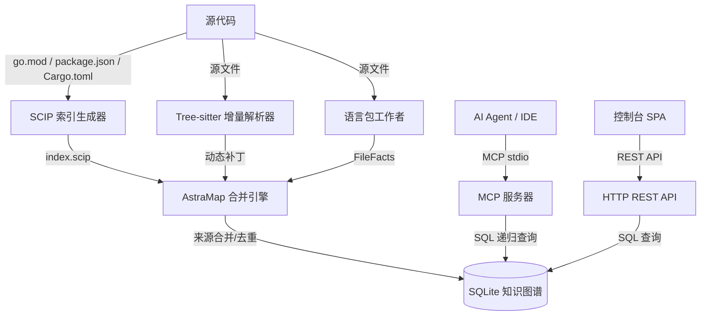

# AstraMap 设计文档

> **定位**：一个独立的高精度语义代码地图引擎。通过 MCP (Model Context Protocol) stdio 服务和 HTTP REST API，为 AI 编程代理（Claude Code、Cursor、Codex 等）和开发者提供代码库的 "节点 + 边" 全景关系图，实现函数级精确定位和极致的 Token 压缩。

---

## 1. 第一性原理：为什么需要 AstraMap

### 1.1 核心矛盾

| 维度 | 没有代码地图 | 有代码地图 |
|-----------|-----------------|---------------|
| 定位一个函数 | `grep` → 读取文件 → 判断上下文 ≈ **3-5 次工具调用，5K-20K Token** | `astramap_node symbol=foo` → **1 次调用，≈800 Token** |
| 理解调用链 | 重复 grep + 读取 ≈ **10-20 次调用** | `astramap_explore query="auth flow"` → **1 次调用** |
| 影响分析 | 几乎无法精确完成 | `astramap_impact symbol=handleRequest` → 递归传播图 |

**结论**：代码地图将 AI Agent 的 Token 消耗降低 **60-80%**，同时将准确率从正则匹配的 ≈70% 提升到 SCIP 语义精度 **95%+**。

### 1.2 双重价值

```
┌─────────────────────────────────────────────┐
│              AstraMap 引擎                   │
│                                             │
│  ┌──────────────┐    ┌──────────────────┐   │
│  │  MCP 服务器   │    │  HTTP 控制台      │   │
│  │  (AI Agent)   │    │  (开发者)        │   │
│  │              │    │                  │   │
│  │  → 代码地图  │    │  → 星域可视化    │   │
│  │  → Token ↓   │    │  → 探索/追踪     │   │
│  │  → 导航      │    │  → 影响图        │   │
│  └──────────────┘    └──────────────────┘   │
│         ▲                    ▲               │
│         │   共享 SQLite 数据库 │               │
│         └────────┬───────────┘               │
│                  │                           │
│         ┌────────┴─────────┐                 │
│         │  节点 + 边        │                 │
│         │  (知识图谱        │                 │
│         │   存储)          │                 │
│         └──────────────────┘                 │
└─────────────────────────────────────────────┘
```

---

## 2. 系统架构

### 2.1 系统拓扑与数据流



### 2.2 "SCIP 高精度源 + Tree-sitter 动态补丁 + 语言包工作者" 三轨融合模型

```
                    索引构建流水线
                    ═══════════════════

  ┌─────────────────┐   ┌─────────────────┐   ┌─────────────────┐
  │   SCIP 索引      │   │  Tree-sitter   │   │  语言包         │
  │   (静态高精度    │   │  (增量语法补丁) │   │  (外部进程工作者)│
  │    度)           │   │                 │   │                 │
  │                  │   │                 │   │                 │
  │  scip-clang      │   │  Go/WASM 解析器 │   │  Dart/Ruby/Lua │
  │  scip-go         │   │  12 种内置语法  │   │  Scala/Swift   │
  │  scip-typescript │   │  增量文件扫描   │   │  Visual Basic  │
  │  scip-python     │   │  实时补丁       │   │  Zig           │
  │  scip-java       │   │                 │   │                │
  │  scip-rust       │   │                 │   │  languageprotocol│
  │  scip-dotnet     │   │                 │   │  v1 有线协议    │
  │  scip-php        │   │                 │   │                 │
  └────────┬─────────┘   └────────┬─────────┘   └────────┬─────────┘
           │                      │                       │
           │ provenance:"scip"    │ provenance:"tree-sitter" provenance:"language-package"
           │                      │                       │
           ▼                      ▼                       ▼
  ┌─────────────────────────────────────────────────────────────────┐
  │                    合并引擎                                      │
  │                                                                 │
  │  规则：SCIP 边 > Tree-sitter 边（同源冲突）                     │
  │        Tree-sitter 补充 SCIP 未覆盖的文件                        │
  │        语言包补充内置语法未覆盖的文件                            │
  │        边的 provenance 字段标记数据来源                          │
  └──────────────────────────┬──────────────────────────────────────┘
                             │
                             ▼
  ┌─────────────────────────────────────────────────────────────────┐
  │                    SQLite 知识图谱                               │
  │                                                                 │
  │  节点：id, kind, name, qualified_name,                         │
  │         file_path, language, start_line, end_line,              │
  │         start_column, end_column, signature, docstring,         │
  │         visibility, return_type, is_exported, provenance        │
  │                                                                 │
  │  边：source, target, kind, provenance, line, col, metadata    │
  │                                                                 │
  │  文件：path, content_hash, language, size,                     │
  │         modified_at, modified_at_ns, indexed_at, node_count     │
  │                                                                 │
  │  FTS5 全文索引：astramap_fts(name, qualified_name,              │
  │                docstring, signature)                             │
  └─────────────────────────────────────────────────────────────────┘
```

### 2.3 数据模型

#### 节点类型 (NodeKind)

| 类型 | 描述 | SCIP 来源 | Tree-sitter 来源 | 语言包来源 |
|------|-------------|-------------|-------------------|---------------------|
| `function` | 函数 | ✓ 方法/函数 | ✓ function_definition | ✓ DefinitionFact |
| `method` | 方法 | ✓ 方法 | ✓ method_declaration | ✓ DefinitionFact |
| `class` | 类 | ✓ 类 | ✓ class_declaration | ✓ DefinitionFact |
| `struct` | 结构体 | ✓ 结构体 | ✓ struct_specifier | ✓ DefinitionFact |
| `interface` | 接口 | ✓ 接口 | ✓ interface_declaration | ✓ DefinitionFact |
| `variable` | 变量 | ✓ 变量/字段 | ✓ variable_declarator | ✓ DefinitionFact |
| `constant` | 常量 | ✓ 常量 | ✓ const_declaration | ✓ DefinitionFact |
| `enum` | 枚举 | ✓ 枚举 | ✓ enum_specifier | ✓ DefinitionFact |
| `macro` | 宏 | ✓ 宏 | ✓ #define 行 | — |
| `route` | HTTP 路由 | — | ✓ 启发式 | — |
| `external` | 外部符号 | ✓ | ✓ 占位符 | ✓ DefinitionFact |
| `typedef` | 类型别名 | ✓ TypeAlias | ✓ type_definition | ✓ DefinitionFact |
| `type` | 类型 | ✓ 类型 | ✓ type_declaration | ✓ DefinitionFact |

#### 边类型 (EdgeKind)

| 类型 | 描述 | 语义 |
|------|-------------|-----------|
| `calls` | 函数调用 | A 调用 B |
| `contains` | 包含关系 | file→class, class→method |
| `imports` | 导入 | 文件 A 导入文件 B |
| `extends` | 继承 | 类 A 继承类 B |
| `implements` | 实现 | 类 A 实现接口 B |
| `references` | 引用 | 通用引用关系 |
| `type_of` | 类型注解 | 变量的类型是类 X |
| `returns` | 返回类型 | 函数返回类型 X |
| `overrides` | 重写 | 方法 A 重写方法 B |

#### 来源追踪 (Provenance)

每个节点和边都携带 `provenance` 字段标记其数据来源：

| 来源 | 描述 |
|-----------|-------------|
| `scip` | SCIP 编译器级索引（最高精度） |
| `tree-sitter` | Tree-sitter AST 解析（中等精度） |
| `heuristic` | 启发式推断（例如路由解析、跨文件调用匹配） |
| `language-package` | 外部语言包工作者（中等精度） |

---

## 3. 项目结构

```
astramap/
├── cmd/amap/                    # CLI 入口点
│   ├── main.go                  # 子命令分发、SCIP 配方系统、索引编排
│   └── language.go              # 语言包子命令（install/update/enable/disable/remove/list/doctor）
│
├── astramap/                    # 核心引擎包
│   ├── astramap.go              # 数据模型（AstraMapNode/Edge/File）、SCIP 导入、增量同步
│   ├── schema.go                # SQLite DDL、Schema 初始化和迁移
│   ├── graph.go                 # 图查询引擎（callers/callees/impact/deadcode/cycles/trace）
│   ├── service.go               # 高层查询服务（search/explore/overview/projection）
│   ├── query_helpers.go         # 查询辅助（文件路径缓存、源代码行缓存、预处理器守卫注解）
│   ├── treesitter.go            # Tree-sitter 解析、每语言定义规则、跨文件调用解析
│   ├── filter.go                # 索引过滤、生态感知排除规则
│   ├── language_registry.go     # 语言规范、检测、能力、语义提供者
│   ├── language_specs_extended.go # 扩展规范（Rust、C#、Kotlin、PHP、Bash）
│   ├── language_install.go      # 语言包安装、签名验证、目录
│   ├── language_packages.go     # 语言包注册表、激活、运行时快照
│   ├── language_worker.go       # 基于进程的语言工作者（handshake/parse/shutdown）
│   ├── project_units.go         # 项目单元检测、提供者边界合并
│   ├── mcp.go                   # MCP stdio JSON-RPC 服务器（9 个工具）
│   ├── server.go                # HTTP REST API 服务器（13+ 端点、控制台 SPA）
│   └── web/                     # 控制台前端
│       ├── index.html           # SPA 主入口
│       ├── index.css            # 基础样式（深色 + Morning Pearl 浅色主题）
│       ├── explore.js / explore.css  # 代码探索视图
│       ├── trace.js / trace.css      # 依赖分析视图
│       ├── d3.min.js            # D3.js 力导向图
│       └── marked.min.js        # Markdown 渲染
│
├── languageprotocol/            # 语言包有线协议
│   └── protocol.go              # v1 协议：Request/Response、Handshake、ParseRequest、FileFacts
│
├── language-packs/              # 外部语言工作者实现
│   ├── dart/                    # Dart 语言包
│   ├── lua/                     # Lua 语言包
│   ├── ruby/                    # Ruby 语言包
│   ├── scala/                   # Scala 语言包
│   ├── swift/                   # Swift 语言包
│   ├── visualbasic/             # Visual Basic 语言包
│   ├── zig/                     # Zig 语言包
│   ├── internal/sdk/sdk.go      # 语言包 SDK（共享库）
│   └── cmd/pack/                # 语言包打包工具
│
├── scripts/                     # 构建和部署脚本
│   └── languages/
│       ├── build-package.sh     # 构建语言包 ZIP
│       └── install-mainstream.sh # 安装主流语言包
│
├── tests/                       # 集成测试夹具
│   ├── lib.sh                   # 共享测试库
│   └── languages/               # 每语言测试夹具
│       ├── dart/ lua/ ruby/ scala/ swift/ visualbasic/ zig/
│
├── docs/                        # 设计和部署文档
│   ├── astramap_design.md       # 本文档
│   ├── DEPLOY.md                # 部署指南
│   ├── astramap-index-filter-design-v3.0.md
│   ├── cli-command-analysis.md
│   ├── ecosystem-aware-filtering.md
│   ├── external-call-placeholder-binding.md
│   ├── language-plugin-long-term-architecture.md
│   └── v0.3-changelog.md
│
├── go.mod                       # 模块：astramap-standalone, Go 1.25.0
├── Makefile                     # 构建目标
├── README.md                    # 用户文档
├── QUICKSTART.md                # 2 分钟部署指南
├── TESTING.md                   # 测试指南
├── AGENTS.md                    # AI 代理指令
└── THIRD_PARTY_NOTICES.md       # 第三方许可证声明
```

---

## 4. 核心模块设计

### 4.1 数据模型 (`astramap/astramap.go`)

#### AstraMapNode

```go
type AstraMapNode struct {
    ID            string `json:"id"`             // 全局唯一: "lang:filepath:qualified_name"
    Kind          string `json:"kind"`           // function/method/class/struct/...
    Name          string `json:"name"`           // 短名称
    QualifiedName string `json:"qualified_name"` // 完全限定名
    FilePath      string `json:"file_path"`      // 相对于项目根目录的路径
    Language      string `json:"language"`       // 语言 ID
    StartLine     int    `json:"start_line"`
    EndLine       int    `json:"end_line"`
    StartColumn   int    `json:"start_column"`
    EndColumn     int    `json:"end_column"`
    Signature     string `json:"signature"`      // 函数签名
    Docstring     string `json:"docstring"`      // 文档注释
    Visibility    string `json:"visibility"`     // public/private/protected
    ReturnType    string `json:"return_type"`    // 返回类型
    IsExported    int    `json:"is_exported"`    // 0 或 1
    Provenance    string `json:"provenance"`     // scip/tree-sitter/heuristic/language-package
    UpdatedAt     int    `json:"updated_at"`     // Unix 时间戳
}
```

#### AstraMapEdge

```go
type AstraMapEdge struct {
    ID         int    `json:"id"`
    Source      string `json:"source"`      // 源节点 ID
    Target      string `json:"target"`      // 目标节点 ID
    Kind        string `json:"kind"`        // calls/contains/imports/extends/...
    Provenance  string `json:"provenance"`  // scip/tree-sitter/heuristic
    Line        int    `json:"line"`        // 调用点行号
    Col         int    `json:"col"`         // 调用点列号
    Metadata    string `json:"metadata"`    // JSON（例如预处理器守卫）
}
```

#### AstraMapFile

```go
type AstraMapFile struct {
    Path           string `json:"path"`
    ContentHash    string `json:"content_hash"`
    Language       string `json:"language"`
    Size           int    `json:"size"`
    ModifiedAt     int    `json:"modified_at"`
    ModifiedAtNS   int    `json:"modified_at_ns"`
    IndexedAt      int    `json:"indexed_at"`
    NodeCount      int    `json:"node_count"`
    Errors         string `json:"errors"`     // JSON 数组
}
```

#### 关键函数

| 函数 | 描述 |
|----------|-------------|
| `ValidateScipIndexFile` | 验证 SCIP 索引文件格式 |
| `ImportScipIndexToAstraMap` | 将单个 SCIP 索引导入 SQLite |
| `ImportScipIndexesToAstraMap` | 批量导入多个 SCIP 索引 |
| `SyncFileAstraMap` | 增量同步单个文件（基于哈希的脏检测） |
| `SyncAllFilesAstraMapResult` | 全量增量扫描并返回统计 |
| `SyncChangedFilesAstraMapResult` | 仅同步变更文件（用于监视模式） |
| `PruneExcludedFiles` | 移除排除路径的节点/边 |
| `PruneDeletedFiles` | 移除已删除文件的节点/边 |
| `ResolveGoInterfaces` | 解析 Go 接口实现边 |
| `ResolveWebRoutes` | 启发式 HTTP 路由发现和边创建 |
| `ProvenanceStats` | 按来源统计节点/边数量 |
| `EffectiveLanguageCapabilities` | 每语言的运行时能力报告 |

### 4.2 Schema (`astramap/schema.go`)

SQLite DDL，使用 WAL 模式、FTS5 全文搜索和自动迁移：

**表**：
- `astramap_nodes` — 符号节点，带 FTS5 虚拟表 `astramap_fts`
- `astramap_edges` — 关系边，在 (source, target, kind, provenance, line) 上有唯一约束
- `astramap_files` — 文件追踪，带内容哈希用于增量检测

**索引**：
- `idx_am_nodes_kind`, `idx_am_nodes_name`, `idx_am_nodes_qname`, `idx_am_nodes_file`, `idx_am_nodes_lower_name`
- `idx_am_edges_source_kind`, `idx_am_edges_target_kind`, `idx_am_edges_kind`, `idx_am_edges_unique`
- `idx_am_files_language`

**FTS5 触发器**：`am_fts_ai`, `am_fts_ad`, `am_fts_au` — 在插入/删除/更新时自动同步

**迁移逻辑** (`InitAstraMapSchema`)：
1. 在创建唯一索引前对现有边进行去重
2. 将 NULL metadata 规范化为空字符串
3. 向 files 表添加 `modified_at_ns` 列
4. 向 nodes 表添加 `provenance` 列并回填（scip→heuristic→tree-sitter）
5. 重新创建唯一边索引

**SQLite Pragmas**：
```sql
PRAGMA journal_mode(WAL);
PRAGMA synchronous(NORMAL);
PRAGMA busy_timeout(10000);
PRAGMA mmap_size(268435456);
PRAGMA cache_size(-65536);
PRAGMA temp_store(MEMORY);
```

### 4.3 图查询引擎 (`astramap/graph.go`)

| 函数 | 描述 |
|----------|-------------|
| `GetCallers` | 符号的直接上游调用者 |
| `GetCallersLimited` | 分页上游调用者 |
| `GetCallees` | 符号的直接下游被调用者 |
| `AnalyzeImpact` | 递归变更影响分析（BFS，深度限制，HIGH/MEDIUM/LOW 级别） |
| `TracePath` | 从符号 A 到 B 的最短调用路径（单向 BFS，最大深度 50） |
| `FindDeadCode` | 从入口点（main 函数、路由）可达性分析死代码 |
| `FindCycles` | 循环依赖检测 |
| `GetCouplingMetrics` | 模块 Ca/Ce 耦合分析 |
| `GetCodeOwners` | 基于 Git blame 的代码所有权 |

**影响分析算法**：
1. 从根符号开始，BFS 遍历调用者
2. 追踪每个访问节点的深度
3. 分类影响：depth=1 → HIGH, depth=2 → MEDIUM, depth≥3 → LOW
4. 批量解析规范符号 ID 以防止 N+1 查询

**死代码检测算法**：
1. 识别入口点：`main` 函数 + HTTP 路由
2. 从入口点正向 BFS 遍历被调用者
3. 所有未到达的 function/method 节点即为死代码

### 4.4 服务层 (`astramap/service.go`)

由 MCP 和 REST 处理程序共享的高层查询服务：

| 类型/函数 | 描述 |
|---------------|-------------|
| `IndexStatus` | 节点/边/文件/脏数据计数 |
| `ExploreResult` | 结构化代码探索（文件 + 符号 + 源代码） |
| `GraphDataResult` | 完整图数据（节点 + 边 + 文件） |
| `ProjectedGraphResult` | 模块级投影图（缓存） |
| `ModuleGraphResult` | 模块依赖图 |
| `QueryGraphData` | 带去重和规范化的完整图查询 |
| `QueryProjectedGraph` | 带概览缓存的模块级投影 |
| `cleanQueryTerms` | 搜索查询的停用词移除（英文 + 中文） |

**概览缓存**：`ProjectedGraphResult` 缓存在内存中，并通过 `InvalidateOverviewCache()` 在任何图变更时失效。

### 4.5 查询辅助 (`astramap/query_helpers.go`)

| 函数 | 描述 |
|----------|-------------|
| `BatchNodeFilePaths` | 批量将节点 ID 解析为文件路径（缓存 + 批量 SQL） |
| `cachedSourceLines` | 源代码行缓存，键为 (path, mtime, size) |
| `activePreprocessorGuards` | 给定行处的 C/C++ 预处理器守卫栈 |
| `annotateConditionalMetadata` | 用活动的 `#ifdef`/`#ifndef` 守卫注解边 |
| `InvalidateQueryHelperCache` | 完整缓存失效 |
| `InvalidateQueryHelperCacheForFile` | 每文件缓存失效 |

**预处理器守卫注解**：对于 C/C++ 边，系统读取源代码行，在调用点追踪 `#if`/`#ifdef`/`#ifndef`/`#endif` 栈，并将活动守卫写入边的 `metadata` 字段。这使得条件编译感知无需单独的数据库表即可实现。

### 4.6 Tree-sitter 解析器 (`astramap/treesitter.go`)

**12 种内置语法**：Go、Python、TypeScript、JavaScript、C、C++、Java、Rust、C#、Kotlin、PHP、Bash

**每语言定义规则** (`DefinitionRule`)：
- `Kind` — 要匹配的 AST 节点类型
- `NameField` — 包含符号名称的字段
- `Scope` — 如何确定作用域（文件、类、方法等）
- `Callable` — 此定义是否可调用
- `Normalizer` — 语言特定的名称规范化函数

**关键规范化器**：
- `normalizeGoMethodDefinition` — 提取接收者结构体
- `normalizeGoTypeDefinition` — 结构体/接口类型检测
- `normalizePythonFunctionDefinition` — 方法 vs 函数区分
- `normalizeCFunctionDefinition` — C++ 限定标识符处理
- `rustCallableDefinition`, `kotlinTypeDefinition`, `kotlinCallableDefinition`

**跨文件调用解析** (`ResolveCrossFileCalls`)：
1. 从所有索引节点构建全局可调用符号注册表
2. 对于 Tree-sitter 数据中的每个未解析调用，使用正则模式匹配注册表
3. 应用语言特定的导入路径解析（Go、Python、Java、Rust、PHP、shell）
4. 创建 `provenance: "heuristic"` 的启发式边

**C 函数指针解析** (`buildFunctionPointerFieldMap`)：
- 解析结构体定义中的函数指针字段
- 从通过结构体字段的调用创建到匹配函数定义的调用边

### 4.7 索引过滤器 (`astramap/filter.go`)

**生态感知过滤**：自动检测项目生态系统并生成排除规则：

| 生态系统 | 排除路径 |
|-----------|---------------|
| Go | `vendor/`, Gocache |
| Node.js | `node_modules/`, `dist/`, `.next/` |
| Rust | `target/` |
| Maven/Gradle | `.gradle/`, `target/` |
| CMake | `build/`, `cmake-build-*/` |
| Python | `__pycache__/`, `.venv/`, `*.egg-info/` |
| Swift | `.build/`, `.swiftpm/` |
| Bazel | `bazel-*/` |

**排除类型**：VCS_METADATA, HIDDEN_PATH, DEPENDENCY, BUILD_ARTIFACT, GENERATED_SOURCE, CACHE, MINIFIED, BINARY, USER_CONFIGURED

**生成文件检测**：扫描前 8KB 以查找 `// Code generated by`、`DO NOT EDIT`、`@generated` 等标记。

**配置**：`.astramap/config.yaml`，包含 include/exclude glob 模式、force-include 覆盖。

### 4.8 语言注册表 (`astramap/language_registry.go` + `language_specs_extended.go`)

**LanguageSpec** — 完整的语言定义：

| 字段 | 描述 |
|-------|-------------|
| `ID` | 语言标识符（例如 "go", "python"） |
| `DisplayName` | 人类可读名称 |
| `Aliases` | 替代名称 |
| `IDPrefix` | 节点 ID 前缀 |
| `QualifiedSeparator` | 限定名分隔符（例如 Java 为 ".", Rust 为 "::"） |
| `Extensions` | 文件扩展名 |
| `Detection` | 检测规则（扩展名、文件名、shebang） |
| `Semantic` | 语义提供者绑定 |
| `Capabilities` | 能力集（definitions, containers, localCalls 等） |
| `Toolchain` | 所需工具链（编译器、SCIP 工具） |
| `Syntax` | Tree-sitter 语法规范（定义规则、调用规则、导入规则） |

**7 种核心语言**（内置语法 + SCIP 提供者）：
Go、TypeScript、JavaScript、Python、Java、C、C++

**5 种扩展语言**（内置语法，无 SCIP）：
Rust、C#、Kotlin、PHP、Bash

**7 种语言包语言**（外部工作者）：
Dart、Lua、Ruby、Scala、Swift、Visual Basic、Zig

**语义提供者**：

| 提供者 | SCIP 工具 | 配方 |
|----------|-----------|--------|
| `go` | scip-go | `ScipRecipeGo` |
| `typescript` | scip-typescript | `ScipRecipeNode` |
| `python` | scip-python | `ScipRecipePython` |
| `clang` | scip-clang | `ScipRecipeClang` |
| `java` | scip-java | `ScipRecipeJVM` |
| `rust` | scip-rust | `ScipRecipeRust` |
| `dotnet` | scip-dotnet | `ScipRecipeDotNet` |
| `php` | scip-php | `ScipRecipePHP` |

**项目画像** (`BuildProjectProfile`)：扫描项目目录，按扩展名计数文件，确定存在哪些语言及其相对重要性。

### 4.9 项目单元检测 (`astramap/project_units.go`)

**ProjectUnit** — 项目中一个独立的可构建/可索引单元：

```go
type ProjectUnit struct {
    Root       string   // 单元根目录
    Ecosystem  string   // 生态系统标识符
    ProviderID string   // 语义提供者 ID
    Manifests  []string // 检测到的清单文件
    Languages  []string // 适用的语言 ID
    Identity   string   // 基于 SHA-256 的单元身份哈希
}
```

**检测算法** (`DetectProjectUnits`)：
1. 遍历项目文件系统，匹配 `projectMarkers`
2. 按 (root, provider) 分组为单元
3. 对于未检测到清单的提供者，在项目根目录创建后备单元
4. 从 provider + root + manifests 计算身份哈希
5. 应用 `mergeProviderSubUnits` 折叠子单元

**项目标记**：

| 生态系统 | 清单 |
|-----------|-----------|
| go | `go.mod` |
| node | `package.json`, `tsconfig.json` |
| python | `pyproject.toml`, `setup.py` |
| clang | `compile_commands.json`, `CMakeLists.txt`, `Makefile` |
| jvm | `pom.xml`, `build.gradle`, `settings.gradle` |
| rust | `Cargo.toml` |
| dotnet | `*.sln`, `*.csproj` |
| php | `composer.json` |

**提供者边界合并** (`mergeProviderSubUnits`)：

此机制防止子目录在被权威祖先覆盖时被当作独立的项目单元处理。例如，根目录和子目录都有 `Makefile` 的 C 项目应该只在根目录生成一个 `compile_commands.json`。

**边界谓词** (`providerBoundaries`)：

| 提供者 | 边界规则 |
|----------|--------------|
| `clang` | 拥有 `compile_commands.json` |
| `typescript` | 拥有 `tsconfig.json` |
| `dotnet` | 拥有 `*.sln` 文件 |
| `java` | 拥有 `settings.gradle`/`settings.gradle.kts` 或包含 `<modules` 的 `pom.xml` |
| `rust` | 拥有包含 `[workspace]` 的 `Cargo.toml` |
| `python` | 拥有包含 `[tool.uv.workspace]` 的 `pyproject.toml` |

**边界组合器**：
- `ownsExactManifest(names...)` — 单元具有其中一个命名清单
- `ownsManifestSuffix(suffix)` — 单元具有给定后缀的清单
- `ownsManifestContent(name, marker)` — 单元具有包含标记文本的清单
- `anyProjectBoundary(boundaries...)` — 多个边界的逻辑或

**动态扩展**：语言包清单可以在运行时声明 `projectAggregates` 来扩展边界。

**合并算法**：
1. 构建 `owners` 映射：对于每个提供者，识别哪些单元根是“权威的”
2. 对于每个非权威单元，检查是否有任何祖先目录是拥有者
3. 如果是，移除子单元（它被祖先覆盖）
4. 权威的嵌套根保持独立（例如，具有自己 `Cargo.toml` 的工作区成员）

### 4.10 语言包系统

#### 有线协议 (`languageprotocol/protocol.go`)

版本 1，最大帧大小 64 MiB，长度前缀的 JSON 帧：

```
[4 字节：大端序 uint32 大小][JSON 载荷]
```

**协议流程**：
1. 核心发送带有 `coreMin`/`coreMax` 版本范围的 `Handshake` 请求
2. 工作者响应 `HandshakeResponse`（moduleID、version、protocol、capabilities）
3. 核心按文件发送 `ParseRequest`（language、projectRoot、relativePath、source）
4. 工作者响应 `FileFacts`（definitions、calls、imports、diagnostics）
5. 核心发送 shutdown；工作者退出

**数据类型**：

| 类型 | 描述 |
|------|-------------|
| `Manifest` | 语言包清单（schema、ID、version、detection、capabilities、artifacts、signature） |
| `Handshake` / `HandshakeResponse` | 协议协商 |
| `ParseRequest` | 文件解析请求，包含源代码内容 |
| `FileFacts` | 解析结果：definitions、calls、imports、diagnostics |
| `DefinitionFact` | 符号定义（localID、kind、name、qualifiedName、signature、docstring） |
| `CallFact` | 调用关系（callerLocalID、calleeName、line、column） |
| `ImportFact` | 导入语句（path、alias、line） |
| `Diagnostic` | 解析诊断（severity、message、line） |

#### 语言工作者 (`astramap/language_worker.go`)

`processLanguageModule` — 管理外部语言工作者进程：

| 方法 | 描述 |
|--------|-------------|
| `Probe()` | 启动工作者进程，执行握手 |
| `Parse(request)` | 发送解析请求，返回 FileFacts |
| `Close()` | 发送 shutdown，停止进程 |

**进程生命周期**：
1. 使用 stdin/stdout 管道启动可执行文件
2. 交换握手帧（版本协商）
3. 通过请求/响应帧解析文件
4. 超时：每次操作 2 分钟
5. 请求/响应配对的关联 ID 匹配
6. 互斥锁保护的并发访问

**事实到图的转换** (`languageFactsToGraph`)：
- 转换 `DefinitionFact` → `AstraMapNode`，带语言特定的身份规范化
- 转换 `CallFact` → `AstraMapEdge`，带启发式被调用者解析
- 转换 `ImportFact` → 导入边

#### 语言包管理 (`astramap/language_install.go` + `language_packages.go`)

**安装流水线**：
1. 解析来源（目录 URL 或本地路径）
2. 获取包归档（最大 512 MiB）
3. 检查归档：验证 ZIP 结构，验证 Ed25519 签名
4. 提取到用户语言根目录（`~/.astramap/languages/`）或项目作用域
5. 写入安装收据（manifest SHA256、key ID、签名状态）
6. 验证激活（与现有包无冲突）

**安全**：
- 通过 `trusted-keys.json` 进行 Ed25519 签名验证
- 除非显式提供 `--allow-unsigned`，否则拒绝未签名包
- 所有产物的 SHA256 完整性检查
- 基于文件的锁定，带过期锁检测

**注册表快照** (`languageRegistrySnapshot`)：
- 合并内置语言与已安装语言包
- 解决冲突（内置优先）
- 通过 ID、别名、扩展名、文件名提供统一查找

**CLI 子命令** (`amap language`)：
- `install <id|path|url>` — 安装语言包
- `update <id|path|url>` — 更新到最新版本
- `list [--json]` — 列出已安装的包
- `enable <id> <version>` — 启用已禁用的包
- `disable <id>` — 禁用但不移除
- `remove <id> <version>` — 卸载包
- `doctor <id>` — 验证包并测试工作者握手

### 4.11 SCIP 配方系统 (`cmd/amap/main.go`)

**配方类型**：

| 配方 | 函数 | 描述 |
|--------|----------|-------------|
| `ScipRecipeGo` | `prepareGoScip` | `scip-go index --module-root <root> -o <output>` |
| `ScipRecipeNode` | `prepareNodeScip` | `scip-typescript index --cwd <root> --output <output>` + 自动生成 tsconfig.json |
| `ScipRecipePython` | `preparePythonScip` | `scip-python index --cwd <root> --output <output>` |
| `ScipRecipeClang` | `prepareClangScip` | `scip-clang --compdb-path <filtered> --index-output-path <output>` + compile_commands.json 管理 |
| `ScipRecipeJVM` | `commandRecipe` | `scip-java index --output <output>` |
| `ScipRecipeRust` | `defaultArtifactRecipe` | `scip-rust index .`，带产物备份 |
| `ScipRecipeDotNet` | `defaultArtifactRecipe` | `scip-dotnet index`，带产物备份 |
| `ScipRecipePHP` | `defaultArtifactRecipe` | `scip-php index`，带产物备份 |
| `ScipRecipePackage` | `preparePackageScip` | 语言包 SCIP 提供者的通用配方 |

**清理栈**：每个配方返回一个带有清理栈的 `preparedScipRun`，在失败时按反向顺序运行，确保不留下临时文件。

**SCIP 生成流水线** (`runScipGeneration`)：
1. 当其文档语言与选定单元匹配时，复用有效的 `<unitRoot>/index.scip`
2. 否则在打印进度或启动进程前检查提供者特定的先决条件
3. 如果缺少先决条件，静默使用 Tree-sitter；这不是提供者失败
4. 创建产物目录：`.astramap/scip/<provider>/<unitID>/`
5. 通过配方准备 → 获取命令 + 产物路径 + 清理栈
6. 在单元根目录中运行命令
7. 通过 `ValidateScipIndexFile` 验证输出
8. 原子提交：重命名 `.pending` → `index.scip`
9. 只有已启动的提供者失败才会发出 WARN 并反向运行清理

**compile_commands.json 验证** (`requireCompileCommands`)：

对于 C/C++ 项目，系统将 `compile_commands.json` 视为用户拥有的构建输入：

1. 如果存在有效的 `compile_commands.json` → 复用它
2. 如果缺失或无效 → 跳过 SCIP 并回退到 Tree-sitter
3. 绝不隐式执行 `bear`、`make`、`cmake` 或干净构建
4. **过滤** (`prepareCompileCommandsJson`)：
   - 将相对路径规范化为绝对路径
   - 应用索引过滤器以排除不需要的文件
   - 将过滤后的版本写入 `.astramap/compile_commands.filtered.json`

**tsconfig.json 自动生成** (`ensureTsConfig`)：
- 对于没有 `tsconfig.json` 的 JS/TS 项目，生成最小配置
- 包含 `**/*.js`, `**/*.ts`, `**/*.tsx` 等
- 排除 `node_modules`, `dist`, `.astramap`, `build`
- 通过清理栈在 SCIP 生成后移除

### 4.12 索引编排 (`cmd/amap/main.go`)

**`runIndex` 流程**：

```
1. 确保索引过滤器配置示例
2. 加载索引过滤器
3. 打开 SQLite 数据库（WAL 模式）
4. 确定选定的语言：
   a. 从上次运行加载保存的语言选择
   b. 如果没有，通过文件扩展名计数检测项目语言
   c. 如果检测到多个，提示用户选择
   d. 合并新安装的语言包语言
5. 生成/导入 SCIP 索引：
   a. 如果指定了 --scip 文件 → 直接导入
   b. 否则 → 自动检测项目单元并按单元生成 SCIP
   c. 如果存在 SCIP 索引且没有 --refresh-scip，则跳过
6. Tree-sitter 增量扫描：
   a. 同步所有文件（或监视模式的变更文件）
   b. 基于哈希的脏检测
   c. 修剪排除/已删除的文件
7. 显示来源统计（SCIP vs Tree-sitter vs 启发式）
8. 如果 --watch：启动 fsnotify 监视器，带防抖同步
```

**监视模式** (`watchIndexCmd`)：
- 基于 fsnotify 的文件监视器
- 防抖：累积脏文件，按间隔最多同步一次
- 自动将新目录添加到监视
- 同步失败时，重新入队脏文件

### 4.13 MCP 服务器 (`astramap/mcp.go`)

**协议**：stdio JSON-RPC 2.0

**9 个工具**：

| 工具 | 描述 | 关键参数 |
|------|-------------|---------------|
| `astramap_search` | 模糊符号搜索，带分页 | `query`, `kind`, `limit`, `offset` |
| `astramap_explore` | 区域代码流探索 | `query`, `maxFiles` |
| `astramap_node` | 符号实体详情解析（处理重载） | `symbol`, `file` |
| `astramap_callers` | 上游调用者追踪 | `symbol`, `limit` |
| `astramap_callees` | 下游被调用者追踪 | `symbol` |
| `astramap_impact` | 反向依赖影响分析 | `symbol`, `depth` |
| `astramap_trace` | 两个符号之间的调用路径追踪 | `from`, `to` |
| `astramap_status` | 索引覆盖率和状态查询 | — |
| `astramap_files` | 索引文件列表，带过滤器 | `path`, `pattern`, `limit`, `offset` |

**服务器指令**：AI 代理的引导规则 — 优先使用 `astramap_explore` 而非 grep，使用 `astramap_node` 进行重载解析。

### 4.14 HTTP REST API (`astramap/server.go`)

**13+ 端点**：

| 端点 | 描述 |
|----------|-------------|
| `/api/astramap/status` | 索引健康指标 |
| `/search` | 符号搜索 |
| `/overview` | 投影模块图 |
| `/functions` | 函数列表 |
| `/data` | 完整图数据 |
| `/node/` | 节点详情 |
| `/callers/` | 上游调用者 |
| `/callees/` | 下游被调用者 |
| `/impact/` | 影响分析 |
| `/explore` | 代码探索 |
| `/trace` | 调用路径追踪 |
| `/api/snippet` | 源代码片段 |
| `/api/documents/*` | 自动生成的理解文档 |
| `/api/modules` | 模块依赖图 |
| `/api/complexity/calculate` | 代码复杂度指标 |

**特性**：
- Gzip 压缩（608KB → 130KB 典型值）
- 带 ETag 的静态资源缓存
- 探索/追踪视图的懒加载
- 文件读取缓存
- 通过批量解析消除 N+1 查询
- 监视守护进程集成（基于 fsnotify 的文件监控）

**自动生成文档**：
- `synthesizeFileDoc` — 每文件理解文档
- `synthesizeModuleDoc` — 每模块理解文档
- `synthesizeProjectDoc` — 项目级理解文档
- 从符号名称/关键词进行角色推断
- 复杂度指标：圈复杂度、LOC、嵌套深度、扇入/扇出

**Mermaid 依赖图**：`buildMermaidDepGraph` 从依赖映射生成 Mermaid 流程图。

**对称性风险检测**：`symmetryRisks` 识别缺少对称清理的成对资源操作（例如，lock 而没有 unlock，open 而没有 close）。

### 4.15 控制台前端 (`astramap/web/`)

**单页应用**，包含两个主视图：

1. **探索视图** (`explore.js` + `explore.css`)：
   - 带符号搜索的代码探索
   - 文件级符号列表
   - 带行号的源代码显示
   - 关系可视化

2. **追踪视图** (`trace.js` + `trace.css`)：
   - 依赖分析
   - 调用路径追踪
   - 影响图可视化

**可视化**：用于模块级概览的 D3.js 力导向图

**主题**：深色主题（默认）+ Morning Pearl 浅色主题 (`body.theme-light`)

**响应式设计**：桌面、平板和手机断点

---

## 5. CLI 命令参考

| 命令 | 描述 |
|---------|-------------|
| `amap serve` | 启动 stdio MCP 服务器 |
| `amap dashboard [--host] [--port]` | 启动 Web 控制台 |
| `amap index [options]` | 构建/更新代码地图索引 |
| `amap watch [seconds]` | 持续增量监控 |
| `amap install` | 一键 MCP 注册到 IDE |
| `amap language <action>` | 语言包管理 |
| `amap diff [--suggest-tests]` | 基于 git diff 的影响分析 |
| `amap locate <symbol>` | 符号定义定位 |
| `amap hotspots` | 代码热点检测 |
| `amap deadcode` | 死代码分析 |
| `amap cycles` | 循环依赖检测 |
| `amap coupling [--path=...]` | 模块耦合分析 |
| `amap owners <symbol>` | 通过 git blame 的代码所有权 |
| `amap query "<SQL>"` | 直接在图上执行 SQL 查询 |
| `amap tree <symbol>` | 调用拓扑树 |

**索引选项**：
- `--lang c,python` — 指定语言
- `--scip index.scip` — 导入现有 SCIP 索引
- `--scip-only` — 仅导入 SCIP，跳过 Tree-sitter
- `--refresh-scip` — 强制重新生成 SCIP
- `--full` — 完整 SCIP 刷新 + Tree-sitter 增量
- `--tree-sitter` / `--treesitter-only` — 仅 Tree-sitter
- `--watch [seconds]` — 索引后继续监控

**全局选项**：`--project <path>` — 指定项目根目录（所有命令均支持）

---

## 6. 关键设计决策

### 6.1 SCIP 作为主要索引源

**原理**：SCIP 索引由具有完整类型信息和跨文件解析的语言特定编译器/工具生成。Tree-sitter 是单文件解析器，无法自行解析跨文件调用。通过使用 SCIP 作为主要来源，Tree-sitter 作为动态补丁，我们实现了：

- **跨文件调用由编译器预计算**（SCIP）vs **仅单文件解析**（Tree-sitter）
- **类型感知解析**（SCIP）vs **仅语法解析**（Tree-sitter）
- **95%+ 准确率**（SCIP）vs **≈70% 准确率**（Tree-sitter + 启发式）

### 6.2 提供者边界合并

**问题**：在 monorepo 或多模块项目中，子目录可能包含自己的清单文件（例如嵌套的 `Makefile`、`Cargo.toml`、`pom.xml`）。如果不合并，每个子目录都将成为独立的项目单元，导致：
- 冗余的 SCIP 生成尝试
- 在无法独立构建的子目录中构建失败
- 重复或冲突的索引数据

**解决方案**：`mergeProviderSubUnits` 应用一个提供者中立的规则：对于每个语义提供者，仅保留最外层的根。后代清单配置外层单元；同级根保持独立。

### 6.3 compile_commands.json 输入策略

**问题**：C/C++ 项目需要 `compile_commands.json` 用于 scip-clang。子目录 Makefile 可以触发独立的 `bear -- make` 尝试，导致失败。

**解决方案**：
1. 嵌套的相同提供者单元合并到其最外层根
2. 只有该根可以生成 SCIP
3. 复用现有的有效 compdb
4. 缺失或无效的 compdb 导致只读回退到 Tree-sitter

### 6.4 语言包进程隔离

**原理**：外部语言工作者作为通过 `languageprotocol` 通信的独立进程运行。这提供了：
- **崩溃隔离**：工作者崩溃不会影响核心引擎
- **语言独立性**：每个工作者可以使用自己的运行时（Node.js、Python 等）
- **版本独立性**：工作者可以独立更新
- **安全性**：具有有限文件系统访问权限的沙盒进程

### 6.5 通过内容哈希进行增量同步

**算法**：
1. 对于每个源文件，计算 SHA-256 内容哈希
2. 与 `astramap_files` 中存储的哈希进行比较
3. 如果变更：使用 Tree-sitter 重新解析，更新节点/边
4. 如果未变更：跳过
5. 修剪：移除不再存在的文件的节点/边

**稳定的节点 ID**：`reuseExistingIncrementalIDs` 为未变更的定义复用现有节点 ID，确保跨增量更新的稳定引用。

### 6.6 条件编译感知

**方法**：不是将条件分支存储在单独的数据库表中，而是系统在活动预处理器守卫中注解边的 `metadata` 字段。这是：
- **非侵入性**：不需要 Schema 变更
- **按需**：守卫在查询时从源代码计算
- **可缓存**：结果缓存在 `query_helpers.go` 中
- **可扩展**：可以扩展到 Go build tags、Rust `cfg` 属性

---

## 7. 依赖

| 依赖 | 用途 |
|-----------|---------|
| `github.com/jmoiron/sqlx` | SQLite 数据库访问，带结构体扫描 |
| `modernc.org/sqlite` | 纯 Go SQLite 驱动（不需要 CGO） |
| `github.com/fsnotify/fsnotify` | 跨平台文件系统监视器 |
| `github.com/sourcegraph/scip` | SCIP 索引解析绑定 |
| `github.com/tree-sitter/go-tree-sitter` | Tree-sitter Go 绑定 |
| `github.com/tree-sitter/go-tree-sitter/bindings/*` | 每语言语法绑定 |

**构建**：`make build`（动态），`make build-static-linux`（musl-gcc 静态二进制）

---

## 8. 性能特征

| 指标 | 值 |
|--------|-------|
| SQLite WAL 模式 | 并发读取，单线程写入 |
| mmap_size | 256 MiB |
| cache_size | 64K 页 |
| Gzip 压缩 | 608KB → 130KB（典型 API 响应） |
| 概览缓存 | 内存中的 `ProjectedGraphResult`，在变更时失效 |
| 文件路径缓存 | 内存映射，按文件失效 |
| 源代码行缓存 | 键为 (path, mtime, size)，按文件失效 |
| 批量解析 | 500 节点批量，消除 N+1 |
| 监视防抖 | 可配置间隔（默认 10s） |
| 最大 SCIP 帧 | 64 MiB（语言协议） |
| 最大语言包 | 512 MiB |
